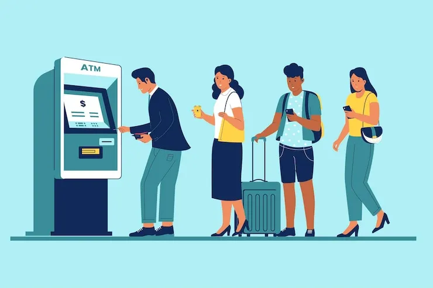
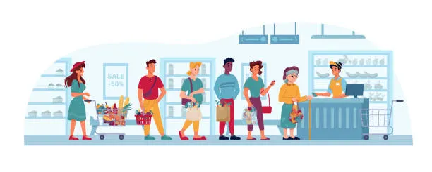

# 📚 Chapter 1 – Introduction to Queue

> **Goal:** Understand what a Queue is, why it follows FIFO, how a Queue works, its terminology, real-life examples, operations, characteristics, applications, and the mental model needed before implementing a Queue in JavaScript.

---

# 1.1 What is a Queue?

A **Queue** is a **linear data structure** that follows the:

# FIFO — First In, First Out

principle.

FIFO means:

> **The element that enters the Queue first will be the element that leaves the Queue first.**

A Queue works exactly like a real-life line of people waiting for a service.

For example:

```text
Front                                      Rear
  ↓                                          ↓

Rahul → Aman → Priya → Rohit
```

* **Rahul** entered first.
* **Rohit** entered last.
* Rahul will be served first.
* Rohit will be served last.

Therefore:

```text
First In  → First Out
Rahul     → Rahul
```

This is why we call it a **FIFO data structure**.

---

# 1.2 Simple Definition

For quick revision:

> **A Queue is a linear data structure in which elements are inserted from the Rear and removed from the Front, following the FIFO (First In, First Out) principle.**

Remember these three things:

```text
Queue
 ↓
FIFO
 ↓
Insert → Rear
Remove → Front
```

If you remember this, you already understand the fundamental idea of a Queue.

---

# 1.3 Why Is It Called FIFO?

A Queue is called **FIFO** because the order in which elements enter the Queue is the same order in which they leave.

Suppose we insert:

```text
10 → 20 → 30 → 40
```

The first element inserted was:

```text
10
```

Therefore, `10` must be removed first.

Removal order:

```text
10 → 20 → 30 → 40
```

Notice:

```text
Insertion Order = 10 → 20 → 30 → 40

Removal Order   = 10 → 20 → 30 → 40
```

The order is exactly the same.

Therefore:

```text
First In
   ↓
10
   ↓
First Out
```

Hence:

# FIFO — First In, First Out

---

# 1.4 FIFO Mental Model

Think of a Queue as a pipe.

New elements enter from one side:

```text
              Rear
               ↓
        → → → → → 
```

and leave from the other side:

```text
Front
  ↓
→ → → → →
```

So:

```text
        INSERT
          ↓
        Rear
          ↓
+----+----+----+----+
| 10 | 20 | 30 | 40 |
+----+----+----+----+
  ↑
Front
  ↓
      REMOVE
```

Therefore:

```text
Enqueue → Rear
Dequeue → Front
```

---

# 1.5 Queue Visualization

Consider:

```text
10 → 20 → 30 → 40
```

A better Queue representation is:

```text
              Rear
                ↓
┌──────┬──────┬──────┬──────┐
│  10  │  20  │  30  │  40  │
└──────┴──────┴──────┴──────┘
   ↑
 Front
```

Here:

* `10` is at the **Front**.
* `40` is at the **Rear**.

If we remove one element:

```text
Dequeue()
```

`10` leaves.

Now:

```text
              Rear
                ↓
┌──────┬──────┬──────┐
│  20  │  30  │  40  │
└──────┴──────┴──────┘
   ↑
 Front
```

The new Front becomes `20`.

---

# 1.6 Real-Life Example – Movie Ticket Counter 🎟️

Imagine several people standing in a line to buy movie tickets.


Suppose people arrive in this order:

```text
Rahul → Aman → Priya → Rohit
```

Visualization:

```text
Front                                      Rear
  ↓                                          ↓

Rahul → Aman → Priya → Rohit
```

### What happens?

**Rahul** arrived first.

Therefore, Rahul is served first.

Then:

```text
Rahul → Aman → Priya → Rohit
  ↑
served first
```

After Rahul gets his ticket:

```text
Front                            Rear
  ↓                                ↓

Aman → Priya → Rohit
```

Then Aman is served.

Then Priya.

Then Rohit.

Therefore:

```text
Arrival Order:
Rahul → Aman → Priya → Rohit

Service Order:
Rahul → Aman → Priya → Rohit
```

The first person who enters the Queue is the first person who leaves it.

**Exactly FIFO.**

---

# 1.7 Real-Life Example – ATM Queue 🏧

Imagine people waiting to use an ATM.





Suppose:

```text
Person A
Person B
Person C
Person D
```

Person A arrives first.

Therefore:

```text
Front
  ↓

Person A
Person B
Person C
Person D

           ↑
          Rear
```


Person A uses the ATM first.


After Person A leaves:

```text
Front
  ↓

Person B
Person C
Person D
```

Then Person B gets the turn.

Again:

```text
First Arrived → First Served
```

That's FIFO.

---

# 1.8 Real-Life Example – Food Ordering System 🍔

Imagine a restaurant receiving orders.




Orders arrive:

```text
Order A
Order B
Order C
Order D
```

The system can process them in arrival order:

```text
Order A → Order B → Order C → Order D
```

The first order received is processed first.

This is a Queue-like processing model.

> **Real systems may use priorities or other scheduling rules, so not every restaurant system is strictly FIFO.**

---

# 1.9 Queue Operations

A Queue mainly provides these operations:

| Operation        | Meaning                          |
| ---------------- | -------------------------------- |
| **Enqueue**      | Insert an element at the Rear    |
| **Dequeue**      | Remove an element from the Front |
| **Front / Peek** | View the Front element           |
| **Rear**         | View the Rear element            |
| **isEmpty**      | Check whether Queue is empty     |
| **Size**         | Return number of elements        |

Let's understand each one.

---

# 1.10 Enqueue

## What is Enqueue?

**Enqueue** means:

> **Insert a new element at the Rear of the Queue.**

Suppose:

```text
Front              Rear
 ↓                   ↓

10 → 20 → 30
```

Now:

```text
enqueue(40)
```

New Queue:

```text
Front                  Rear
 ↓                       ↓

10 → 20 → 30 → 40
```

The new element is always added at the Rear.

---

# 1.11 Dequeue

## What is Dequeue?

**Dequeue** means:

> **Remove an element from the Front of the Queue.**

Suppose:

```text
Front              Rear
 ↓                   ↓

10 → 20 → 30 → 40
```

Now:

```text
dequeue()
```

`10` is removed.

New Queue:

```text
Front           Rear
 ↓                ↓

20 → 30 → 40
```

Why `10`?

Because `10` entered first.

Therefore:

```text
First In → First Out
```

---

# 1.12 Front / Peek

The **Front** operation allows us to see the first element without removing it.

Suppose:

```text
Front
 ↓

10 → 20 → 30
```

Calling:

```text
front()
```

returns:

```text
10
```

But the Queue remains:

```text
10 → 20 → 30
```

Nothing is removed.

This is similar to `peek()` in a Stack, but the position being inspected is different.

---

# 1.13 Rear

The **Rear** represents the position where new elements are inserted.

Suppose:

```text
Front              Rear
 ↓                   ↓

10 → 20 → 30
```

The Rear element is:

```text
30
```

Calling:

```text
rear()
```

can return:

```text
30
```

without removing it.

---

# 1.14 isEmpty

`isEmpty()` checks whether the Queue contains any elements.

Empty Queue:

```text
[]
```

Result:

```text
true
```

Queue containing elements:

```text
[10,20,30]
```

Result:

```text
false
```

---

# 1.15 Size

`size()` returns the number of elements currently in the Queue.

Example:

```text
10 → 20 → 30 → 40
```

Therefore:

```text
size = 4
```

---

# 1.16 Queue Operation Summary

```text
                QUEUE
                  │
       ┌──────────┼──────────┐
       ↓          ↓          ↓
   Enqueue     Dequeue     Peek
       ↓          ↓          ↓
     Rear       Front      Front
```

The most important rule:

```text
Enqueue → Rear
Dequeue → Front
```

---

# 1.17 Queue vs Stack

This is one of the most important DSA comparisons.

### Stack

```text
LIFO
Last In → First Out
```

### Queue

```text
FIFO
First In → First Out
```

| Stack           | Queue             |
| --------------- | ----------------- |
| LIFO            | FIFO              |
| Insert at Top   | Insert at Rear    |
| Remove from Top | Remove from Front |
| Push            | Enqueue           |
| Pop             | Dequeue           |
| Peek Top        | Peek Front        |

---

# 1.18 Visual Comparison

### Stack

```text
        Top
         ↓
       ┌────┐
       │ 30 │ ← Remove
       ├────┤
       │ 20 │
       ├────┤
       │ 10 │
       └────┘
```

```text
Last In → First Out
```

---

### Queue


```text
             Rear
               ↓
┌────┬────┬────┬────┐
│ 10 │ 20 │ 30 │ 40 │
└────┴────┴────┴────┘
  ↑
Front
  ↓
Remove
```

```text
First In → First Out
```

---

# 1.19 Why Do We Need a Queue?

A Queue is useful when data needs to be processed **in arrival order**.

Suppose requests arrive:

```text
Request A
Request B
Request C
Request D
```

If we process them using FIFO:

```text
A → B → C → D
```

This prevents later requests from automatically jumping ahead of earlier requests.

---

# 1.20 Real-World Applications of Queue

Queues appear everywhere in computer science.

### 1. Print Queue

Suppose several documents are sent to a printer:

```text
Document A
Document B
Document C
```

The printer can process:

```text
A → B → C
```

---

### 2. CPU / Task Scheduling

Tasks may wait in a scheduling queue.

```text
Task A → Task B → Task C
```

The scheduler can process tasks according to its scheduling policy.

> Note: Real CPU scheduling can use priority, round-robin, multilevel queues, and other policies, so it isn't always strict FIFO.

---

### 3. Web Server Requests

Suppose requests arrive:

```text
Request 1
Request 2
Request 3
Request 4
```

A system may queue requests before processing them.

---

### 4. Message Queues

Systems often use queues to temporarily hold messages:

```text
Producer
   ↓
Queue
   ↓
Consumer
```

This allows producers and consumers to work independently.

---

### 5. BFS

Queue is fundamental to:

# Breadth-First Search

BFS explores a graph or tree level by level.

The typical pattern is:

```text
Visit Node
    ↓
Enqueue neighbours
    ↓
Dequeue next node
    ↓
Continue
```

Understanding Queue is therefore essential before learning BFS.

---

### 6. Customer Service Systems

Customers can wait in a queue:

```text
Customer A
Customer B
Customer C
```

The system processes them according to its chosen service policy.

---

# 1.21 Important Queue Terms

There are several terms you must know.

---

## Front

The **Front** is the position from which elements are removed.

Example:

```text
Front
 ↓

10 → 20 → 30
```

`10` is the Front element.

---

## Rear

The **Rear** is the position where new elements are inserted.

```text
10 → 20 → 30
          ↑
         Rear
```

`30` is the Rear element.

---

# 1.22 Important Terminology

| Term         | Meaning                                               |
| ------------ | ----------------------------------------------------- |
| Front        | Where deletion occurs                                 |
| Rear         | Where insertion occurs                                |
| Enqueue      | Insert into Queue                                     |
| Dequeue      | Remove from Queue                                     |
| Peek / Front | View first element                                    |
| Rear         | View last element                                     |
| Underflow    | Removing from an empty Queue                          |
| Overflow     | Queue capacity exceeded in fixed-size implementations |

---

# 1.23 Queue Underflow

Suppose:

```text
Queue = []
```

Now we try:

```text
dequeue()
```

There is no element to remove.

This condition is called:

# Queue Underflow

> **Queue Underflow occurs when we attempt to remove an element from an empty Queue.**

This will become important when we implement `dequeue()`.

---

# 1.24 Queue Overflow

Queue Overflow traditionally refers to attempting to insert into a Queue that has reached its maximum capacity.

For example, imagine a fixed-size Queue that can store only 3 elements:

```text
Capacity = 3
```

Current:

```text
10 → 20 → 30
```

Trying:

```text
enqueue(40)
```

would exceed its capacity.

This is Queue Overflow.

### Important JavaScript Note

A normal JavaScript Array is dynamically resizable, so our basic Array-based Queue does not have a fixed capacity in the same way a fixed-size array implementation does.

---

# 1.25 Queue Characteristics

A Queue has the following characteristics:

* It is a **linear data structure**.
* It follows **FIFO**.
* Insertion occurs at the **Rear**.
* Deletion occurs at the **Front**.
* It maintains the order of processing.
* It can be implemented using an Array.
* It can be implemented using a Linked List.
* It is widely used in scheduling and buffering.
* It is fundamental to BFS.

---

# 1.26 Is Queue Always FIFO?

A standard Queue is FIFO.

However, there are specialized queue structures that modify the processing rule.

For example:

### Priority Queue

Elements are processed according to priority rather than simple arrival order.

### Deque

Elements can be inserted and removed from both ends.

Therefore, when we say:

> **Queue = FIFO**

we are specifically talking about a **standard Queue**.

---

# 1.27 Queue as an Abstract Data Type

Just like Stack, Queue can be understood as an:

# Abstract Data Type (ADT)

The Queue defines **what operations should be available and how they behave**.

For example:

```text
Enqueue
Dequeue
Front
Rear
isEmpty
Size
```

But the Queue does not necessarily require one specific implementation.

It can be implemented using:

```text
Array
Linked List
Circular Array
```

The implementation can change.

The Queue behaviour remains:

```text
Insert → Rear
Remove → Front
FIFO
```

---

# 1.28 Queue Using an Array

One simple way to implement a Queue is using an Array.

For example:

```javascript
const queue = [];
```

We can conceptually use:

```javascript
queue.push(value);
```

for insertion.

And:

```javascript
queue.shift();
```

for removal.

Example:

```javascript
queue.push(10);
queue.push(20);
queue.push(30);
```

Queue:

```text
[10,20,30]
```

Then:

```javascript
queue.shift();
```

removes:

```text
10
```

Remaining:

```text
[20,30]
```

This demonstrates FIFO behaviour.

---

# 1.29 But There Is a Problem

Although:

```javascript
push()
shift()
```

can implement Queue behaviour, there is an important performance issue.

For a JavaScript Array:

```javascript
shift()
```

can require the remaining elements to be moved/reindexed.

Therefore, `shift()` is generally:

```text
O(n)
```

for an Array.

This means repeatedly using:

```javascript
queue.shift();
```

can become inefficient for a large Queue.

This is something we will solve when implementing our Queue properly.

---

# 1.30 Queue Implementation Options

We have several options.

### Option 1 — Array + `push()` / `shift()`

Simple:

```text
Enqueue → push()
Dequeue → shift()
```

But dequeue is generally O(n).

---

### Option 2 — Array + Front Index

We can maintain an index representing the Front:

```text
queue = [10,20,30,40]

front = 0
```

Then:

```text
queue[front]
```

is the Front.

After dequeue:

```text
front++
```

This can make dequeue O(1).

---

### Option 3 — Linked List

We can maintain:

```text
Front → Node → Node → Node ← Rear
```

Then:

```text
Enqueue → Rear
Dequeue → Front
```

Both can be O(1) with the correct pointers.

We will explore these implementations later.

---

# 1.31 Queue Mental Model

Always visualize a Queue like this:

```text
                 Queue

       Deletion             Insertion
          ↓                    ↓
       FRONT                  REAR
          ↓                    ↓

     ┌──────┬──────┬──────┬──────┐
     │  10  │  20  │  30  │  40  │
     └──────┴──────┴──────┴──────┘
```

Therefore:

```text
Dequeue ← Front | Queue | Rear → Enqueue
```

---

# 1.32 Complete Example

Suppose we start with an empty Queue:

```text
[]
```

### Enqueue 10

```text
[10]
```

### Enqueue 20

```text
[10,20]
```

### Enqueue 30

```text
[10,20,30]
```

### Dequeue

Remove `10`:

```text
[20,30]
```

### Enqueue 40

```text
[20,30,40]
```

### Dequeue

Remove `20`:

```text
[30,40]
```

The processing order was:

```text
10 → 20
```

which matches the arrival order.

---

# 1.33 Complete Dry Run

```text
Create Queue
     ↓
    []

     ↓

Enqueue(10)
     ↓
   [10]

     ↓

Enqueue(20)
     ↓
 [10,20]

     ↓

Enqueue(30)
     ↓
[10,20,30]

     ↓

Dequeue()
     ↓
Removed: 10

     ↓
 [20,30]

     ↓

Enqueue(40)
     ↓
[20,30,40]

     ↓

Dequeue()
     ↓
Removed: 20

     ↓
[30,40]
```

---

# 1.34 Queue vs Real-Life Line

The best mental model is:

```text
People arriving
      ↓

Rear
 ↓
A → B → C → D
↑
Front
```

New person:

```text
E
```

joins at the Rear:

```text
A → B → C → D → E
```

When someone is served:

```text
A
```

leaves from the Front:

```text
B → C → D → E
```

This is exactly:

```text
FIFO
```

---

# 1.35 Why Queue Is Important in DSA

Queue is not just another data structure you need to memorize.

It becomes the foundation for several important concepts:

```text
Queue
  │
  ├── BFS
  │
  ├── Level Order Traversal
  │
  ├── Scheduling
  │
  ├── Buffering
  │
  ├── Request Processing
  │
  ├── Message Queues
  │
  └── Graph Algorithms
```

If you understand Queue properly, later algorithms become much easier.

---

# 1.36 Queue vs Stack – Interview Comparison

| Feature            | Stack                | Queue              |
| ------------------ | -------------------- | ------------------ |
| Principle          | LIFO                 | FIFO               |
| Full form          | Last In First Out    | First In First Out |
| Insertion          | Top                  | Rear               |
| Removal            | Top                  | Front              |
| Insert operation   | Push                 | Enqueue            |
| Remove operation   | Pop                  | Dequeue            |
| View operation     | Peek                 | Front / Peek       |
| Common application | Function calls, Undo | Scheduling, BFS    |

---

# 1.37 Important Interview Questions

### Q1. What is a Queue?

> A Queue is a linear data structure that follows FIFO, where elements are inserted at the Rear and removed from the Front.

---

### Q2. What does FIFO mean?

> FIFO means First In, First Out. The first element inserted into the Queue is the first element removed.

---

### Q3. Where does insertion happen in a Queue?

> Insertion happens at the Rear.

---

### Q4. Where does deletion happen?

> Deletion happens at the Front.

---

### Q5. What is Enqueue?

> Enqueue is the operation of inserting an element at the Rear of the Queue.

---

### Q6. What is Dequeue?

> Dequeue is the operation of removing an element from the Front of the Queue.

---

### Q7. What is the difference between Stack and Queue?

> Stack follows LIFO, while Queue follows FIFO. Stack inserts and removes from the Top, whereas Queue inserts at the Rear and removes from the Front.

---

### Q8. What is Queue Underflow?

> Queue Underflow occurs when we try to remove an element from an empty Queue.

---

### Q9. Can a Queue be implemented using an Array?

> Yes. A Queue can be implemented using an Array, although a naive `push()` + `shift()` implementation can make dequeue O(n).

---

### Q10. Can Queue be implemented using a Linked List?

> Yes. A Linked List with Front and Rear pointers can provide O(1) enqueue and dequeue operations.

---

### Q11. What is the main application of Queue in graph algorithms?

> Breadth-First Search (BFS) uses a Queue to process vertices level by level.

---

### Q12. Is a Queue always FIFO?

> A standard Queue is FIFO. Specialized structures such as Priority Queues use different processing rules.

---

# 1.38 Quick Revision

Remember:

```text
QUEUE
  ↓
Linear Data Structure
  ↓
FIFO
  ↓
First In → First Out
```

And:

```text
Enqueue → Rear
Dequeue → Front
```

And:

```text
Front → Remove
Rear  → Insert
```

---

# 🧠 The Most Important Mental Model

If you remember only one diagram from this chapter, remember this:

```text
                       QUEUE

                 Enqueue / Insert
                        ↓
                      REAR
                        ↓
       ┌──────┬──────┬──────┬──────┐
       │  10  │  20  │  30  │  40  │
       └──────┴──────┴──────┴──────┘
          ↑
        FRONT
          ↓
       Dequeue / Remove
```

So:

> **New elements enter from the Rear, and existing elements leave from the Front. Because the first element to enter is the first element to leave, a standard Queue follows FIFO.**

---

# 🎯 Chapter 1 Interview Checklist

Before moving to implementation, make sure you can answer:

* [ ] What is a Queue?
* [ ] What does FIFO mean?
* [ ] Why is Queue called FIFO?
* [ ] Where does insertion happen?
* [ ] Where does deletion happen?
* [ ] What is Front?
* [ ] What is Rear?
* [ ] What is Enqueue?
* [ ] What is Dequeue?
* [ ] What is Peek/Front?
* [ ] What is Queue Underflow?
* [ ] What is Queue Overflow?
* [ ] Is every Queue strictly FIFO?
* [ ] What is the difference between Stack and Queue?
* [ ] Can Queue be implemented using an Array?
* [ ] Why can `shift()` be inefficient?
* [ ] Can Queue be implemented using a Linked List?
* [ ] Why is Queue important for BFS?
* [ ] What is Queue as an ADT?
* [ ] What is the difference between a standard Queue and a Priority Queue?

---
