## 1. What is a Queue?

A **Queue** is a data structure that follows:

> **FIFO — First In, First Out**

It means:

> The element that enters first is removed first.

Think of a line of people:

```text
First person enters
        ↓
[ Person 1 ][ Person 2 ][ Person 3 ]
     ↑                         ↑
   Front                      Rear
```

`Person 1` entered first, so `Person 1` will leave first.

In programming, we can represent a queue using an array:

```js
let queue = [1, 2, 3, 4, 5, 6, 7];
```

We can visualize it as:

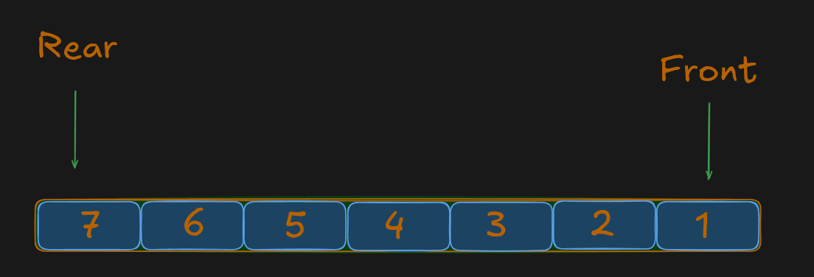

Here:

* `1` is the **front** element.
* `7` is the **rear** element.
* We remove elements from the **front**.
* We insert elements at the **rear**.

### Removing an element

If we perform:

```text
deQueue()
```

the first element, `1`, is removed:

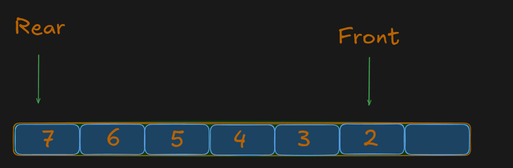

### Adding an element

Now suppose we insert `8`:

```text
enQueue(8)
```

The queue becomes:

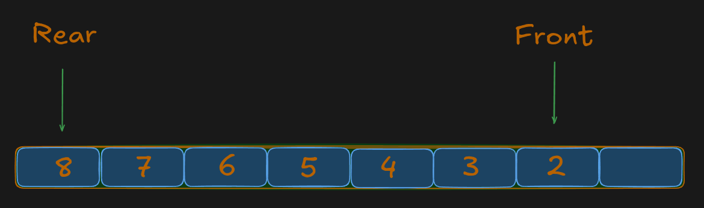

So the basic queue rule is:

```text
Insert  → Rear
Remove  → Front
```

---

## 2. The Problem With a Normal Queue

Suppose we have a queue with a **fixed capacity of 7**.

Initially:

```text
Index:  0    1    2    3    4    5    6

       [ 1 ][ 2 ][ 3 ][ 4 ][ 5 ][ 6 ][ 7 ]
         ↑                                  ↑
       Front                               Rear
```


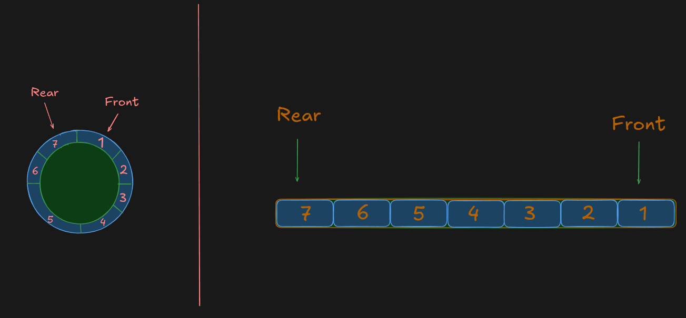

Now remove `1` and `2`.

Conceptually:

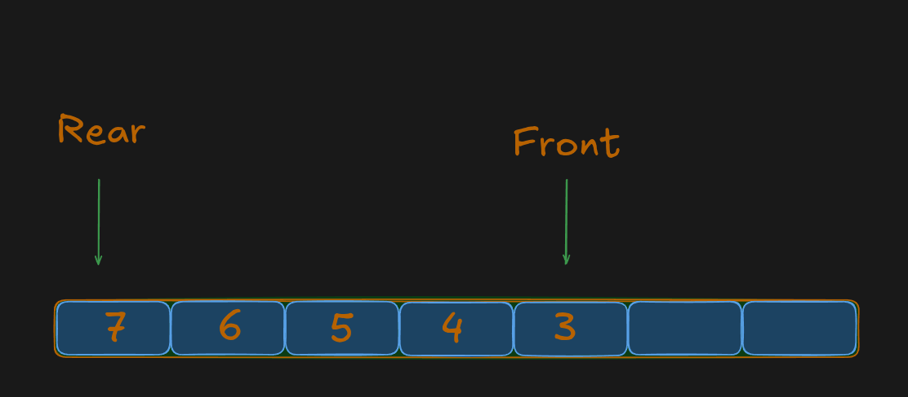

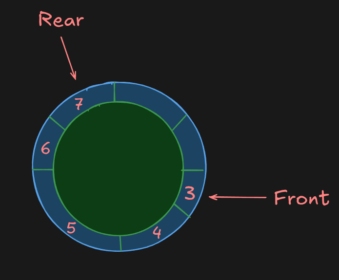

Notice something important:

There are now **two empty spaces at the beginning**:

```text
[   ][   ][ 3 ][ 4 ][ 5 ][ 6 ][ 7 ]
  ↑    ↑
free spaces
```

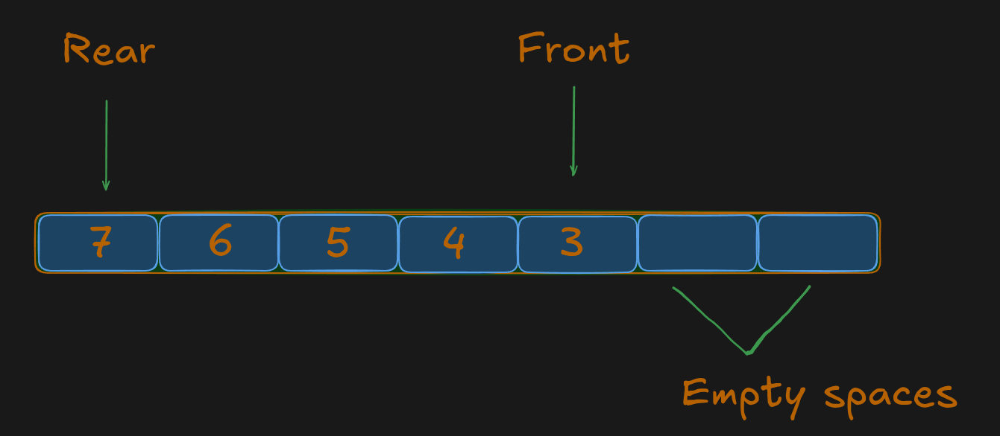

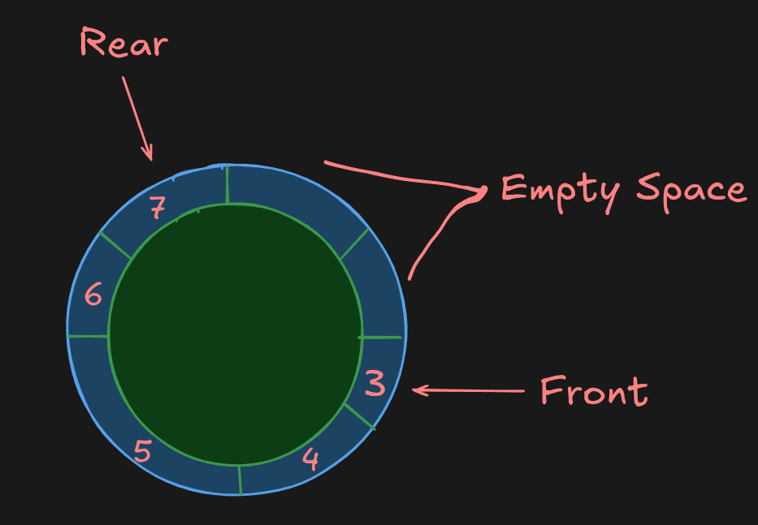

Now suppose we want to insert `8`.

A **linear queue** thinks:

> "The rear is currently at the end, so the next position should be after `7`."

That would look like:

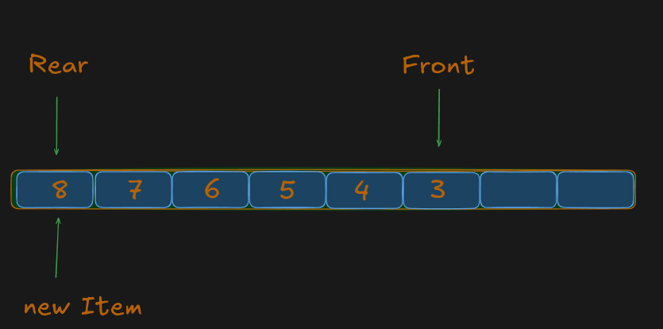

But this is impossible because our queue has a **fixed capacity of 7**, so we cannot add `8`. Even though the first positions are empty, a normal queue cannot reuse them because the rear has already reached the end.

The valid indexes are only:

```text
0  1  2  3  4  5  6
```

There is no index `7`.

### But wait — we already have free spaces

The first two positions are empty:

```text
[   ][   ][ 3 ][ 4 ][ 5 ][ 6 ][ 7 ]
  ↑    ↑
free spaces
```


So, the problem is **not that the queue has no free space**. After removing `1` and `2`, the first two positions are empty:


The problem is that the `rear` is already at the **end of the array**. In a normal linear queue, it cannot go back to index `0` and reuse those empty positions.

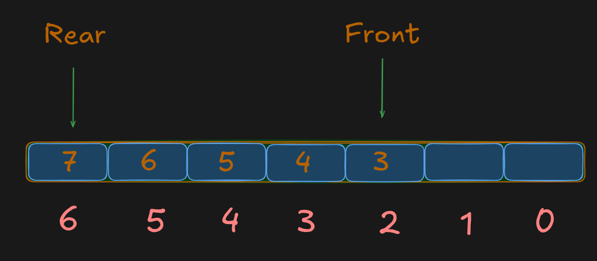

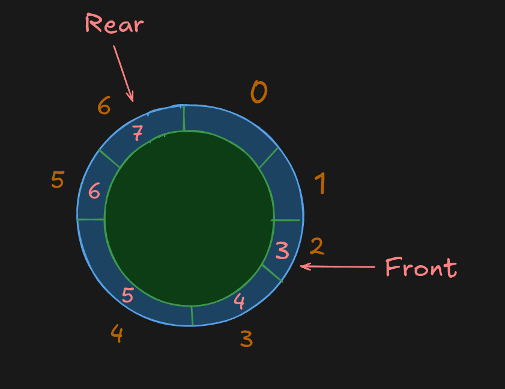

We could shift all elements to the beginning, but that is unnecessary and inefficient.

A **Circular Queue** solves this by allowing the `rear` to **wrap around to the beginning**:

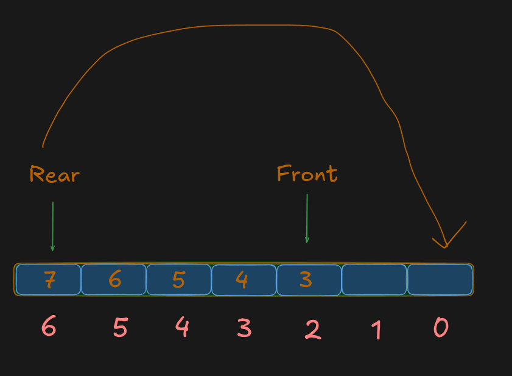

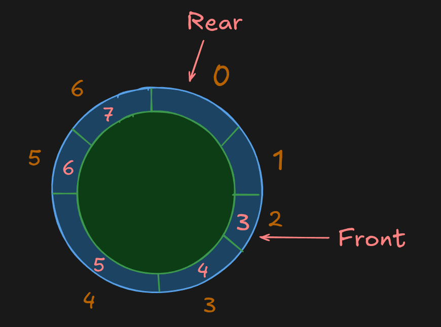

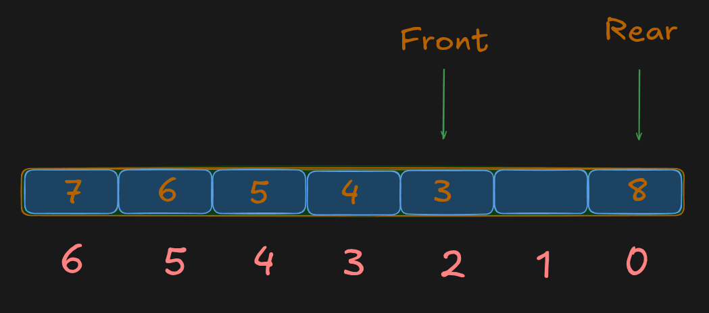

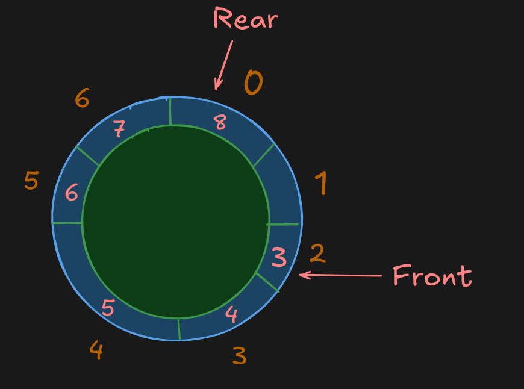

Then `9` can use the next empty position:

```text
[ 8 ][ 9 ][ 3 ][ 4 ][ 5 ][ 6 ][ 7 ]
```

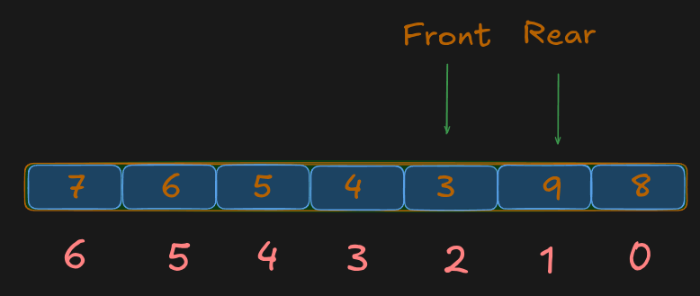

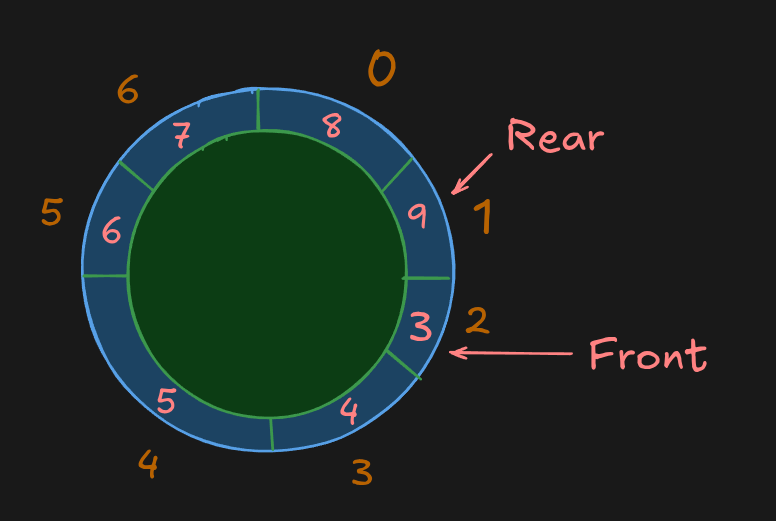

**In simple words:** A Circular Queue reuses the empty spaces at the beginning instead of wasting them.

# 3. What is a Circular Queue?

A **Circular Queue** treats the array as if the **last position is connected back to the first position**.

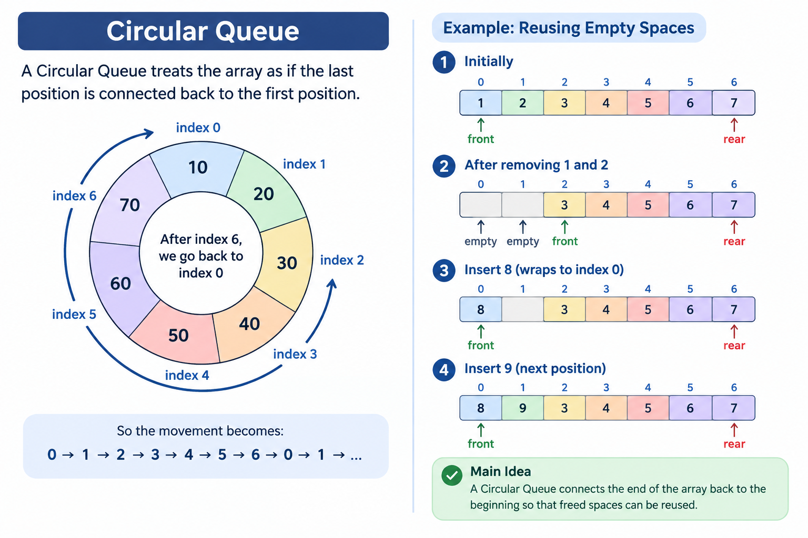

### Reusing Empty Spaces

Initially:

```text
[ 1 ][ 2 ][ 3 ][ 4 ][ 5 ][ 6 ][ 7 ]
```

After removing `1` and `2`:

```text
[   ][   ][ 3 ][ 4 ][ 5 ][ 6 ][ 7 ]
```

The first two positions are now empty.

Instead of wasting them, the Circular Queue wraps around to index `0`.

Insert `8`:

```text
[ 8 ][   ][ 3 ][ 4 ][ 5 ][ 6 ][ 7 ]
  ↑
index 0
```

Then insert `9` at index `1`:

```text
[ 8 ][ 9 ][ 3 ][ 4 ][ 5 ][ 6 ][ 7 ]
```

So, the Circular Queue **reuses the empty spaces created by removing elements instead of wasting them**.

> **Main Idea:** A Circular Queue connects the end of the array back to the beginning so that freed spaces can be reused.

# 4. When Should We Use a Circular Queue?

A Circular Queue is useful when:

* The queue has a **fixed capacity**.
* Elements are continuously added and removed.
* We want to **reuse freed spaces**.
* We don't want to shift elements after every deletion.
* We want operations such as `enQueue()` and `deQueue()` to be **O(1)**.

Common examples include:

* CPU scheduling
* Memory buffers
* Network buffers
* Streaming data
* Producer-consumer systems
* Task scheduling
* Fixed-size caches
* Fixed-size data buffers

The important pattern is:

```text
Fixed capacity
      +
Continuous insertion/removal
      +
Reuse freed positions
      ↓
Circular Queue
```

---

# 5. Important Programming Language Confusion

Different programming languages provide different ways to handle arrays and queues.

For example, JavaScript provides `shift()`. When we call it, the first element is removed and the remaining elements appear at the next lower indexes:

```js
let queue = [1, 2, 3, 4, 5, 6, 7];

queue.shift();

console.log(queue);
```

Output:

```text
[ 2, 3, 4, 5, 6, 7 ]
```

So conceptually:

```text
Before:

[ 1 ][ 2 ][ 3 ][ 4 ][ 5 ][ 6 ][ 7 ]
  0    1    2    3    4    5    6


After shift():

[ 2 ][ 3 ][ 4 ][ 5 ][ 6 ][ 7 ]
  0    1    2    3    4    5
```

The array has effectively **re-indexed the remaining elements**.

But when we implement a **fixed-size Circular Queue ourselves**, we don't want to remove an element and rearrange all the other elements every time.

Instead, we keep the elements where they are and move a `front` index:

```text
Before:

[ 1 ][ 2 ][ 3 ][ 4 ][ 5 ][ 6 ][ 7 ]
  ↑
front = 0


After removing 1:

[   ][ 2 ][ 3 ][ 4 ][ 5 ][ 6 ][ 7 ]
       ↑
     front = 1
```

Here, `1` is considered removed because `front` moved from `0` to `1`. We **did not move `2, 3, 4, ...`**.

This is the important difference:

* **Built-in operations:** the language/library may handle the rearrangement for you.
* **Our Circular Queue implementation:** we manage the indexes ourselves and avoid unnecessary shifting.

This is particularly important when implementing a queue using a **fixed-size array in C or another language where we are managing the array manually**.

> **Main Idea:** We don't need to physically move all elements when removing from a fixed-size Circular Queue. We can simply move the `front` index.

# 6. Front, Back & Size

For a Circular Queue, we track **3 important values**:

```text
front
back
size
```

### 1. `front`

* Points to the **current first element**.
* This is where `deQueue()` removes an element.

```text
[ 10 ][ 20 ][ 30 ][   ][   ][   ][   ]
  ↑
front
```

```text
front = 0
```

---

### 2. `back`

* Points to the **next position where an element will be inserted**.
* It does **not** point to the current last element.
* After insertion, `back` moves to the next position.

```text
[ 10 ][ 20 ][ 30 ][   ][   ][   ][   ]
  ↑              ↑
front           back
```

```text
front → first element
back  → next insertion position
```

---

### 3. `size`

* Tells us **how many elements are currently in the queue**.
* It is different from `capacity`.

```text
capacity = 7   → maximum elements
size     = 3   → current elements
```

Used to determine:

```text
size === 0          → EMPTY

size === capacity  → FULL
```

We need `size` because in a Circular Queue, `front === back` can happen when the queue is **empty or full**.

---

# 8. What Does the `%` Operator Do?

The `%` operator gives the **remainder** after division.

For a queue of length `5`:

```text
0 % 5 = 0
1 % 5 = 1
2 % 5 = 2
3 % 5 = 3
4 % 5 = 4
5 % 5 = 0
6 % 5 = 1
7 % 5 = 2
```

Notice:

```text
0 → 1 → 2 → 3 → 4 → 0 → 1 → 2 → ...
```

So:

> **`index % queue.length` keeps the index within the valid range of the queue.**

For example:

```js
(4 + 1) % 5
```

```text
= 5 % 5
= 0
```

So when the index reaches the end, `%` makes it **wrap back to `0`**.

This is the key idea that makes the array behave like a **Circular Queue**.

### Remember

```text
(index + 1) % queue.length
            ↓
       wrap-around
```

For a queue of length `5`:

```text
0 → 1 → 2 → 3 → 4 → 0 → 1 → ...
```

# 9. Implementing the Circular Queue

Now that we understand `front`, `back`, and `size`, we can implement the Circular Queue.

We use a fixed-size array and move the indexes instead of moving the elements.

---

## 1. Constructor

```js
var MyCircularQueue = function (k) {
    this.queue = new Array(k);
    this.front = 0;
    this.back = 0;
    this.size = 0;
};
```

### What each variable means

```text
queue → fixed-size array
front → current first element
back  → next insertion position
size  → current number of elements
```

Initially:

```text
front = 0
back  = 0
size  = 0
```

So the queue is empty.

---

## 2. `enQueue()`

Adds an element to the queue.

```js
MyCircularQueue.prototype.enQueue = function (value) {
    if (this.isFull()) return false;

    this.queue[this.back] = value;
    this.back = (this.back + 1) % this.queue.length;
    this.size++;

    return true;
};
```

### Steps

```text
1. Check if queue is full
2. Insert at back
3. Move back forward
4. Increase size
```

The important line is:

```js
this.back = (this.back + 1) % this.queue.length;
```

This makes `back` **wrap around**.

For capacity `7`:

```text
0 → 1 → 2 → 3 → 4 → 5 → 6 → 0 → ...
```

---

## 3. `deQueue()`

Removes the first element.

```js
MyCircularQueue.prototype.deQueue = function () {
    if (this.isEmpty()) return false;

    this.queue[this.front] = null;
    this.front = (this.front + 1) % this.queue.length;
    this.size--;

    return true;
};
```

### Steps

```text
1. Check if queue is empty
2. Remove the element at front
3. Move front forward
4. Decrease size
```

Again, we use:

```js
(this.front + 1) % this.queue.length
```

to make `front` wrap around.

---

## 4. `Front()`

Returns the first element.

```js
MyCircularQueue.prototype.Front = function () {
    if (this.isEmpty()) return -1;

    return this.queue[this.front];
};
```

`front` already points to the first element, so we simply return:

```js
this.queue[this.front]
```

---

## 5. `Rear()`

Returns the **last element currently in the queue**.

Remember:

> `back` points to the **next insertion position**, not the last element.

Therefore, the last element is one position before `back`:

```js
(this.back - 1 + this.queue.length) % this.queue.length
```

Implementation:

```js
MyCircularQueue.prototype.Rear = function () {
    if (this.isEmpty()) return -1;

    return this.queue[
        (this.back - 1 + this.queue.length) % this.queue.length
    ];
};
```

The `+ this.queue.length` prevents a negative index when `back` is `0`.

---

## 6. `isEmpty()`

The queue is empty when `size` is `0`.

```js
MyCircularQueue.prototype.isEmpty = function () {
    return this.size === 0;
};
```

```text
size === 0 → EMPTY
```

---

## 7. `isFull()`

The queue is full when `size` reaches the array capacity.

```js
MyCircularQueue.prototype.isFull = function () {
    return this.size === this.queue.length;
};
```

```text
size === capacity → FULL
```

---

# Complete Code

```js
var MyCircularQueue = function (k) {
    this.queue = new Array(k);
    this.front = 0;
    this.back = 0;
    this.size = 0;
};

MyCircularQueue.prototype.enQueue = function (value) {
    if (this.isFull()) return false;

    this.queue[this.back] = value;
    this.back = (this.back + 1) % this.queue.length;
    this.size++;

    return true;
};

MyCircularQueue.prototype.deQueue = function () {
    if (this.isEmpty()) return false;

    this.queue[this.front] = null;
    this.front = (this.front + 1) % this.queue.length;
    this.size--;

    return true;
};

MyCircularQueue.prototype.Front = function () {
    if (this.isEmpty()) return -1;

    return this.queue[this.front];
};

MyCircularQueue.prototype.Rear = function () {
    if (this.isEmpty()) return -1;

    return this.queue[
        (this.back - 1 + this.queue.length) % this.queue.length
    ];
};

MyCircularQueue.prototype.isEmpty = function () {
    return this.size === 0;
};

MyCircularQueue.prototype.isFull = function () {
    return this.size === this.queue.length;
};
```

### Final Mental Model

```text
enQueue()
   ↓
insert at back
   ↓
move back
   ↓
size++

deQueue()
   ↓
remove from front
   ↓
move front
   ↓
size--

Front() → queue[front]

Rear()  → position before back

isEmpty() → size === 0

isFull()  → size === capacity
```

> **The whole Circular Queue works by moving `front` and `back` around the fixed-size array using modulo `%`, while `size` keeps track of how many elements are currently present.**
