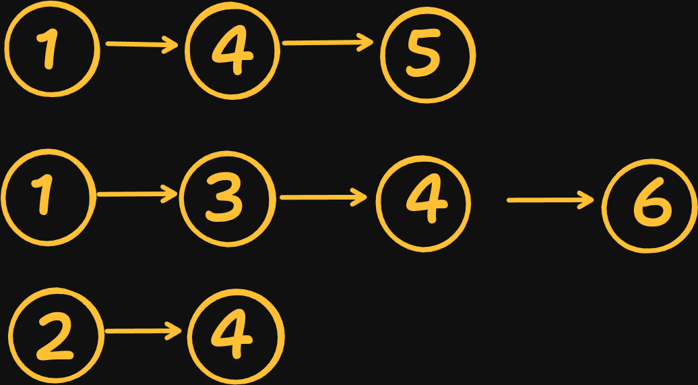
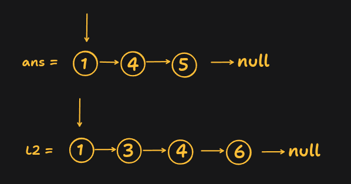

#  Simple Sequential Merge Approach | JavaScript | Merge Two Lists Repeatedly

Each linked list in the input is already sorted in ascending order. Instead of collecting all node values and sorting them again, we can take advantage of this property by **merging two sorted linked lists at a time**, just like the merge step in Merge Sort.

The idea is straightforward:

- Take the first linked list as the initial result.
- Merge it with the second linked list.
- Store the merged linked list back into the result.
- Merge this updated result with the third linked list.
- Continue this process until all linked lists have been merged.

By repeatedly merging two sorted linked lists, we eventually obtain one fully sorted linked list containing all nodes.

---

# Approach

### Step 1: Handle Edge Cases

- If the input array is empty, there are no linked lists to merge, so return `null`.
- If the array contains only one linked list, it is already sorted, so return it directly.

---

### Step 2: Use the First Linked List as the Initial Result

Initialize a variable `ans` with the first linked list.

```text
ans

1 → 4 → 5
```

This variable will always store the merged result after each iteration.

---

### Step 3: Merge the Remaining Lists One by One

Traverse the remaining linked lists from left to right.

For each linked list:

- Merge the current result (`ans`) with the next linked list.
- Store the merged linked list back into `ans`.

Example:

```text
Iteration 1

ans

1 → 4 → 5

Merge with

1 → 3 → 4

↓

1 → 1 → 3 → 4 → 4 → 5
```

Store it back into `ans`.

Next iteration:

```text
ans

1 → 1 → 3 → 4 → 4 → 5

Merge with

2 → 4 → 6

↓

1 → 1 → 2 → 3 → 4 → 4 → 4 → 5 → 6
```

Continue until every linked list has been processed.

---

### Step 4: Merge Two Sorted Linked Lists

To merge two sorted linked lists efficiently:

1. Create a **dummy node** to simplify building the merged list.
2. Maintain a pointer `current` that always points to the last node of the merged list.
3. Compare the current nodes of both linked lists.
4. Attach the node with the smaller value to the merged list.
5. Move the corresponding pointer forward.
6. Repeat until one linked list becomes empty.
7. Attach the remaining nodes from the non-empty linked list.

Since both linked lists are already sorted, always selecting the smaller node guarantees that the merged linked list also remains sorted.

---

### Step 5: Return the Final Result

After merging all linked lists, `ans` contains one completely sorted linked list.

Return `ans`.

---

# Dry Run

### Input

```text
lists = [
    [1, 4, 5],
    [1, 3, 4, 6],
    [2, 4]
]
```



Initially, we take the **first linked list** as our answer.

```text
ans =

1 → 4 → 5
```

---

# Iteration 1

Merge `ans` with the second linked list.




### Comparison 1

```text
L1 = 1
L2 = 1

1 <= 1

Take L1

Merged List

1
```

Move `L1`


---

### Comparison 2

```text
L1 = 4
L2 = 1

1 is smaller

Take L2

Merged List

1 → 1
```


Move `L2`

```text
L2

3 → 4 → 6
```


---

### Comparison 3

```text
L1 = 4
L2 = 3

3 is smaller

Merged List

1 → 1 → 3
```


Move `L2`

```text
L2

4 → 6
```


---

### Comparison 4

```text
L1 = 4
L2 = 4

4 <= 4

Take L1

Merged List

1 → 1 → 3 → 4
```

Move `L1`

```text
L1

5
```

---

### Comparison 5

```text
L1 = 5
L2 = 4

4 is smaller

Merged List

1 → 1 → 3 → 4 → 4
```

Move `L2`

```text
L2

6
```

---

### Comparison 6

```text
L1 = 5
L2 = 6

5 is smaller

Merged List

1 → 1 → 3 → 4 → 4 → 5
```

Move `L1`

```text
L1 = NULL
```

---

### L1 is Empty

Attach the remaining nodes of `L2`.

```text
6
```

Final merged list becomes

```text
ans =

1 → 1 → 3 → 4 → 4 → 5 → 6
```

---

# Iteration 2

Now merge `ans` with the third linked list.

```text
ans

1 → 1 → 3 → 4 → 4 → 5 → 6

List3

2 → 4
```

---

### Comparison 1

```text
1 < 2

Merged

1
```

---

### Comparison 2

```text
1 < 2

Merged

1 → 1
```

---

### Comparison 3

```text
3 > 2

Merged

1 → 1 → 2
```

---

### Comparison 4

```text
3 < 4

Merged

1 → 1 → 2 → 3
```

---

### Comparison 5

```text
4 <= 4

Merged

1 → 1 → 2 → 3 → 4
```

---

### Comparison 6

```text
4 <= 4

Merged

1 → 1 → 2 → 3 → 4 → 4
```

Now `ans` moves to `5` and `List3` becomes empty.

Attach the remaining nodes.

```text
5 → 6
```

---

# Final Answer

```text
1 → 1 → 2 → 3 → 4 → 4 → 4 → 5 → 6
```

---

## Visualization

```text
Input

List1 : 1 → 4 → 5
List2 : 1 → 3 → 4 → 6
List3 : 2 → 4

            │
            ▼

After First Merge

1 → 1 → 3 → 4 → 4 → 5 → 6

            │
            ▼

Merge with List3

1 → 1 → 2 → 3 → 4 → 4 → 4 → 5 → 6

            │
            ▼

Final Merged Linked List
```


# How `merge()` Works

The `merge()` function merges **two sorted linked lists** into one sorted linked list.

### Step 1: Create a Dummy Node

```javascript
let dummy = new ListNode(0);
let current = dummy;
```

The dummy node acts as a temporary starting point, making it easy to build the merged list without handling special cases for the first node.

---

### Step 2: Compare Both Lists

While both linked lists have nodes:

- Compare `L1.val` and `L2.val`.
- Attach the smaller node to `current.next`.
- Move the corresponding pointer forward.
- Move `current` forward.

Example:

```text
L1

1 → 4 → 5

L2

1 → 3 → 4
```

Comparison:

```text
1 <= 1

Take L1

Merged

1
```

Next,

```text
4 > 1

Take L2

Merged

1 → 1
```

Continue until one list becomes empty.

---

### Step 3: Attach Remaining Nodes

If one linked list still has remaining nodes, simply attach them.

```text
Merged

1 → 1 → 3 → 4 → 4 → 5

L2

6
```

Attach `6` directly.

Final merged list:

```text
1 → 1 → 3 → 4 → 4 → 5 → 6
```

---

### Step 4: Return the Result

Return the node after the dummy node.

```javascript
return dummy.next;
```

---

# Why This Works

The key observation is that **every input linked list is already sorted**.

When merging two sorted linked lists, we always compare the current nodes and attach the smaller one to the result. Because we always choose the smallest available node, the merged linked list remains sorted.

After the first merge, we obtain one larger sorted linked list. We then merge this sorted result with the next linked list. Since both lists are sorted, the merged output is again sorted.

Repeating this process for all linked lists guarantees that the final result is one completely sorted linked list containing every node.

Example:

```text
List1

1 → 4 → 5

List2

1 → 3 → 4

↓

Merge

1 → 1 → 3 → 4 → 4 → 5
```

Now merge this result with:

```text
2 → 4 → 6
```

Result:

```text
1 → 1 → 2 → 3 → 4 → 4 → 4 → 5 → 6
```

---

# Complexity Analysis

Let:

- **k** = Number of linked lists
- **N** = Total number of nodes across all linked lists

### Time Complexity

Each merge traverses the current merged list and the next linked list.

Since the merged list keeps growing after every iteration, many nodes are visited multiple times.

**Worst Case:**

```text
O(N × k)
```

---

### Space Complexity

Only a dummy node and a few pointers are used.

The nodes are relinked in place without creating any extra data structures.

```text
O(1)
```

*(Ignoring the space required for the output linked list.)*

---

# Drawback

Although this approach is simple and easy to implement, it is **not the most optimal solution**.

As the merged linked list grows larger after every iteration, each subsequent merge takes more time because it has to traverse the entire merged list again. This causes many nodes to be processed multiple times.

For a large number of linked lists (`k`), this approach becomes inefficient.

---


```js []
/**
 * Definition for singly-linked list.
 * function ListNode(val, next) {
 *     this.val = (val===undefined ? 0 : val)
 *     this.next = (next===undefined ? null : next)
 * }
 */
/**
 * @param {ListNode[]} lists
 * @return {ListNode}
 */
var mergeKLists = function (lists) {
    if (!lists || lists.length === 0) return null;

    if (lists.length === 1) return lists[0]

    let ans = lists[0]

    for (let i = 1; i < lists.length; i++) {
        ans = merge(ans, lists[i])
    }


    return ans

};


var merge = function (L1, L2) {

    let DummyList = new ListNode(0)
    let current = DummyList


    while (L1 && L2) {
        if (L1.val <= L2.val) {
            current.next = L1
            L1 = L1.next;
        } else {
            current.next = L2
            L2 = L2.next;
        }


        current = current.next
    }

    if (L1) {
        current.next = L1
    }


    if (L2) {
        current.next = L2
    }


    return DummyList.next
}


```

# Optimal Approach

A better solution uses a **Priority Queue (Min Heap)**.

Instead of repeatedly merging large linked lists, we always keep the smallest current node from each linked list inside a min heap.

At every step:

- Remove the smallest node from the heap.
- Add it to the answer.
- Insert its next node into the heap (if it exists).

Since the heap contains at most **k** nodes at any time:

- **Time Complexity:** `O(N log k)`
- **Space Complexity:** `O(k)`

This is the **optimal solution** and the approach generally expected in coding interviews and on LeetCode.