# 328. Odd Even Linked List

The name of this problem is a little confusing.

When we hear **Odd Even Linked List**, we usually think about **odd numbers** and **even numbers**.

For example,

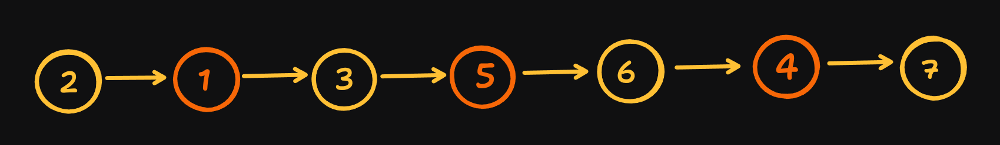

Many people think we should create

```text
Odd Numbers

1 → 3 → 5 → 7

Even Numbers

2 → 6 → 4
```

❌ This is **NOT** what the problem is asking.

---

## Very Important Point

The problem does **NOT** care about the value stored inside the node.

It only cares about the **position (index) of the node**.

Let's number every node.

```text
Position

1    2    3    4    5    6    7

↓

2 → 1 → 3 → 5 → 6 → 4 → 7
```

Now classify them.

### Odd Position Nodes

```text
Position

1
3
5
7
```

Nodes

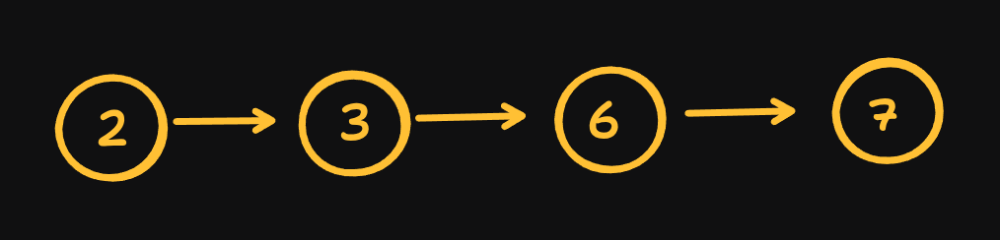

---

### Even Position Nodes

```text
Position

2
4
6
```

Nodes

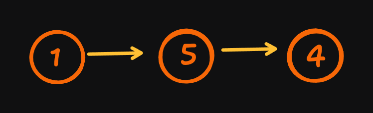

Notice something interesting.

The value

```text
6
```

is an **even number**,

but it is at **position 5**.

So,

```text
6 belongs to the Odd List.
```

Similarly,

```text
5
```

is an odd number,

but it is at **position 4**,

so it belongs to the Even List.

👉 **Always remember:**

> We are separating nodes based on **their position**, **not their value**.

---

Our goal is simple.

Move all **odd position nodes** together.

Move all **even position nodes** together.

Finally,

connect

```text
Odd List

↓

Even List
```

## Example

### `Input`


### `Output`

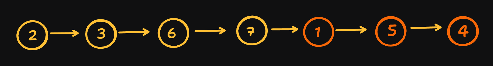

---
Yes. One sentence needed an important correction.

❌ Incorrect:

> **odd points to the odd-position list**

This sounds like `odd` points to the entire list, which isn't accurate.

✅ Correct:

> **odd always points to the last node of the odd-positioned list that has been built so far.**

The same applies to the `even` pointer.

Below is a polished, LeetCode-style approach.

# Approach

Since the linked list is already arranged by position, we don't need to create new nodes or use extra memory. Instead, we rearrange the existing links using **three pointers**.

> **Important:**  
> The words **Odd** and **Even** refer to the **position of the node**, **not the value stored inside the node**.

### For example

**Linked List**


Number each node by its position.

| Position | Value | Type |
|----------|------:|------|
| 1 | 2 | Odd Position |
| 2 | 1 | Even Position |
| 3 | 3 | Odd Position |
| 4 | 5 | Even Position |
| 5 | 6 | Odd Position |
| 6 | 4 | Even Position |
| 7 | 7 | Odd Position |

Notice that **6** is an even number, but it is at **position 5**, so it belongs to the **odd-position list**. Similarly, **5** is an odd number, but it is at **position 4**, so it belongs to the **even-position list**.

Our goal is to:

1. Connect all **odd-positioned nodes** together.
2. Connect all **even-positioned nodes** together.
3. Finally, attach the even list after the odd list.

---

## Step 1: Handle the Edge Case

If the linked list is empty, simply return it.

```javascript
if (head === null) return head;
```

---

## Step 2: Initialize Three Pointers

```javascript
let odd = head;
let even = head.next;
let evenHead = even;
```

Each pointer has a specific responsibility:

### `odd`

- Starts at the **first node**.
- Always points to the **last node of the odd-positioned list** that has been built so far.

### `even`

- Starts at the **second node**.
- Always points to the **last node of the even-positioned list** that has been built so far.

### `evenHead`

- Stores the **first node of the even-positioned list**.
- It never changes.
- We need it at the end to reconnect the even list after the odd list.

---

## Step 3: Rearrange the Links

Traverse the linked list while there are more even nodes available.

```javascript
while (even !== null && even.next !== null)
```

During each iteration, perform these four operations.

### 1. Connect the current odd node to the next odd node

```javascript
odd.next = even.next;
```

### 2. Move the `odd` pointer forward

```javascript
odd = odd.next;
```

Now `odd` points to the last node of the updated odd-positioned list.

### 3. Connect the current even node to the next even node

```javascript
even.next = odd.next;
```

### 4. Move the `even` pointer forward

```javascript
even = even.next;
```

Now `even` points to the last node of the updated even-positioned list.

These four steps are repeated until all nodes have been processed.

---

## Step 4: Join the Two Lists


After the loop:

- All odd nodes are connected together.
- All even nodes are connected together.

Finally, connect the end of the odd list to the beginning of the even list.

```javascript
odd.next = evenHead;
```

### Odd Node List


### Even Node List


The final linked list becomes:


---

## Why This Approach Works

- The `odd` pointer always maintains the end of the odd-positioned list.
- The `even` pointer always maintains the end of the even-positioned list.
- The `evenHead` pointer safely remembers where the even list starts.
- Every node is visited exactly once.
- No new nodes are created—we only change the `next` pointers.

This makes the solution efficient, in-place, and optimal.

# Step-by-Step Algorithm

### Step 1

If the linked list is empty,

return it.

```javascript
if(head === null)
    return head;
```

---

### Step 2

Initialize three pointers.

```text
odd = head

even = head.next

evenHead = even
```

---

### Step 3

Repeat until there are no more even nodes.

```javascript
while(even !== null && even.next !== null)
```

Inside every iteration,

perform four simple operations.

---

### Operation 1

Connect the current odd node to the next odd node.

```javascript
odd.next = even.next;
```

Example

Before

```text
1 → 2 → 3
```

After

```text
1 ─────► 3
```

---

### Operation 2

Move the odd pointer forward.

```javascript
odd = odd.next;
```

Now,

```text
odd points to 3
```

---

### Operation 3

Connect the current even node to the next even node.

```javascript
even.next = odd.next;
```

Example

Before

```text
2 → 3 → 4
```

After

```text
2 ─────► 4
```

---

### Operation 4

Move the even pointer.

```javascript
even = even.next;
```

Repeat these four operations until the loop finishes.

---

### Step 4

Now,

all odd nodes are connected.

All even nodes are connected.

Finally,

attach the even list after the odd list.

```javascript
odd.next = evenHead;
```

---

### Step 5

Return the head.

---

# Dry Run

## Example 1

```text
Input

1 → 2 → 3 → 4 → 5 → 6 → 7 → 8
```

Initially


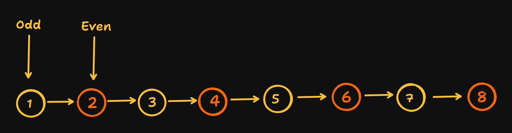


---

### Iteration 1

Connect

```text
1 → 3
```

Move odd

```text
odd = 3
```
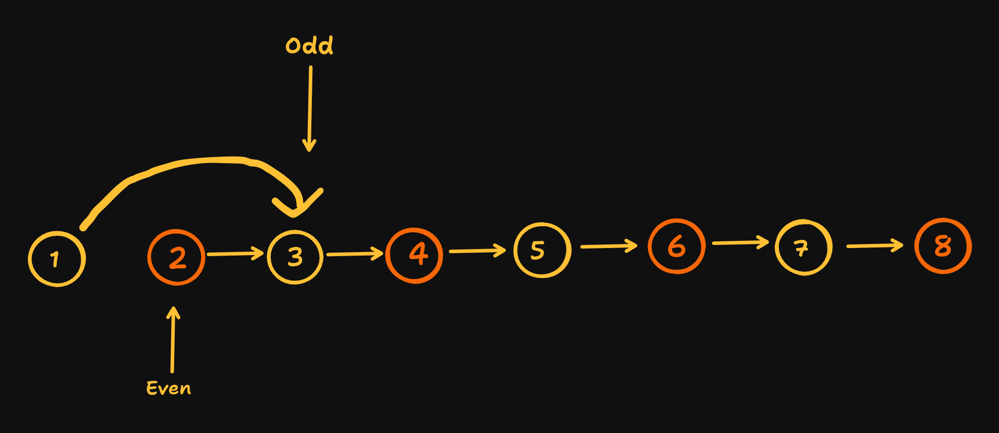


Connect

```text
2 → 4
```

Move even

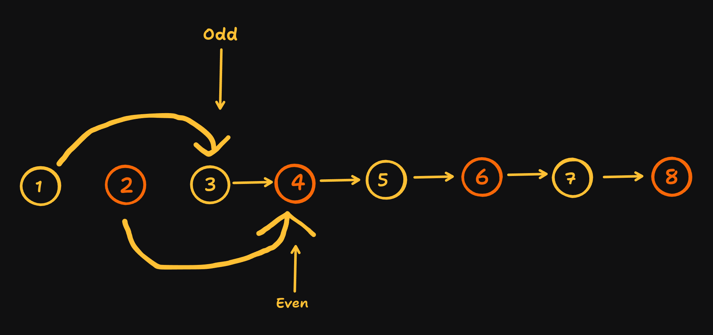


---

### Iteration 2

Connect

```text
3 → 5
```

Move odd

```text
odd = 5
```
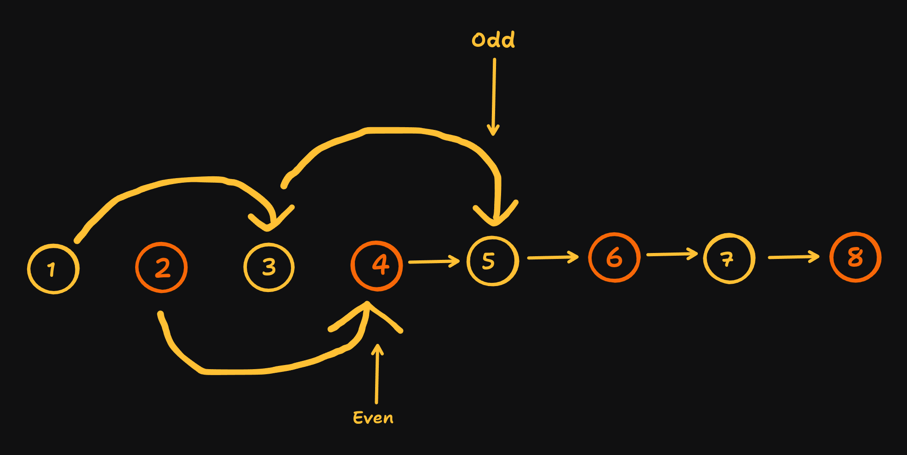

Connect

```text
4 → 6
```

Move even

```text
even = 6
```

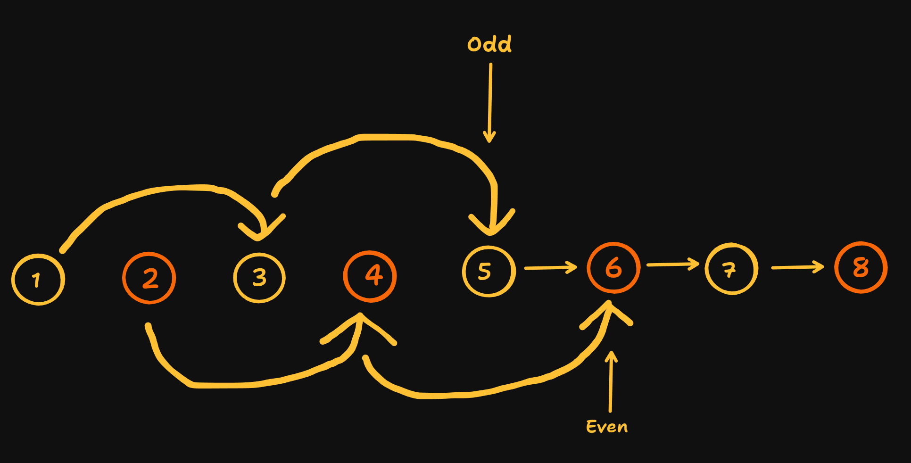

Current Lists

Odd


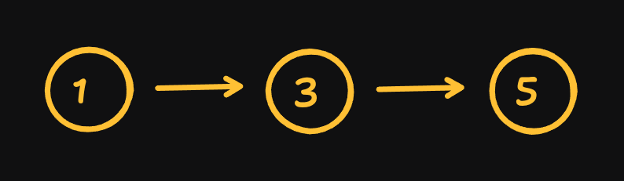

Even


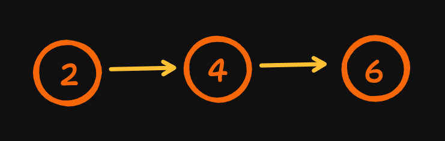

---

### Iteration 3

Connect

```text
5 → 7
```

Move odd

```text
odd = 7
```

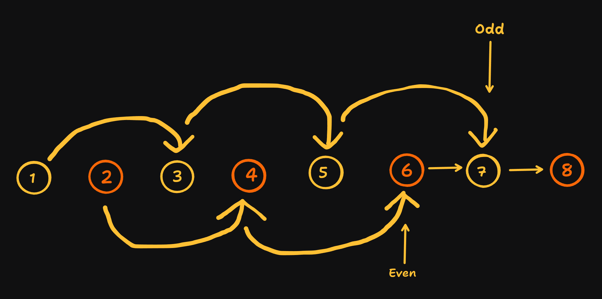

Connect

```text
6 → 8
```

Move even

```text
even = 8
```
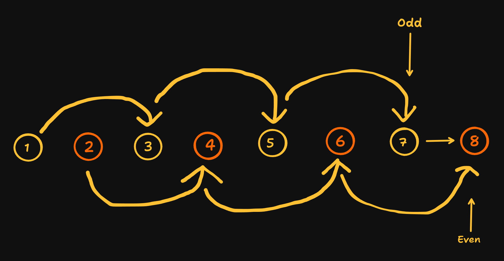
Loop stops because

```text
even.next == null
```

---

Finally

```text
7

↓

2
```

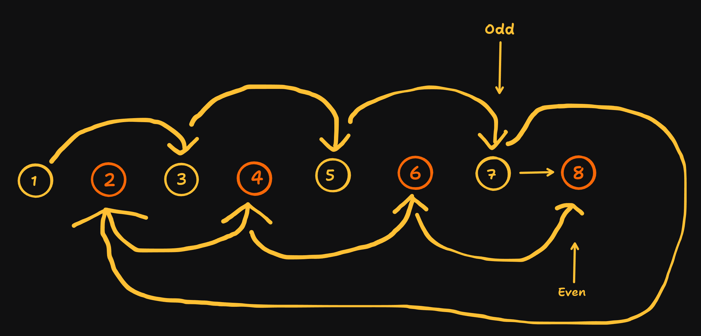

Answer


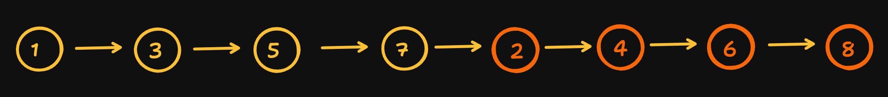


---

# Why do we need `evenHead`?

Suppose we don't save it.

Initially,

```text
2
```

Later,

the even pointer moves like this.

```text
2

↓

4

↓

6

↓

8

↓

null
```

Now,

the pointer is `null`.

We completely lost the beginning of the even list.

That's why we store it at the beginning.

```javascript
let evenHead = even;
```

---

# Why this loop?

```javascript
while(even !== null && even.next !== null)
```

Inside the loop,

we use

```javascript
even.next
```

If `even` becomes `null`,

trying to access

```javascript
even.next
```

will cause an error.

So this condition safely stops the loop.

---

# Correctness

- Every odd node is connected to the next odd node.
- Every even node is connected to the next even node.
- The order of odd nodes never changes.
- The order of even nodes never changes.
- Finally, the odd list is connected with the even list.

Therefore, the final linked list satisfies the problem requirements.

---

# Complexity

### Time Complexity

Every node is visited only once.

```text
O(n)
```

---

### Space Complexity

We only use three pointers.

No extra linked list is created.

```text
O(1)
```

---

# JavaScript Code

```javascript
var oddEvenList = function(head) {

    if (head === null)
        return head;

    let odd = head;
    let even = head.next;
    let evenHead = even;

    while (even !== null && even.next !== null) {

        odd.next = even.next;
        odd = odd.next;

        even.next = odd.next;
        even = even.next;
    }

    odd.next = evenHead;

    return head;
};
```

---

# Key Takeaways

✅ The problem is based on **node positions**, **not node values**.

✅ A node containing **8** can belong to the odd list if it is placed at the **3rd, 5th, or 7th position**.

✅ We maintain **three pointers**:

- `odd`
- `even`
- `evenHead`

✅ We rearrange the links without creating a new linked list.

✅ The solution runs in **O(n)** time and **O(1)** extra space, making it the optimal approach.
