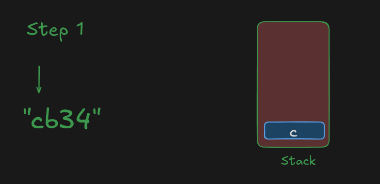
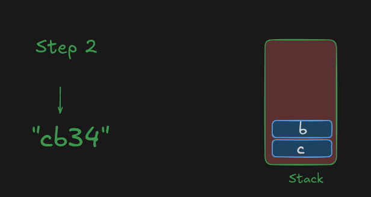
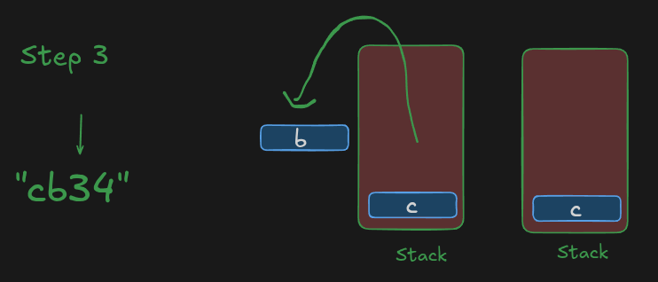
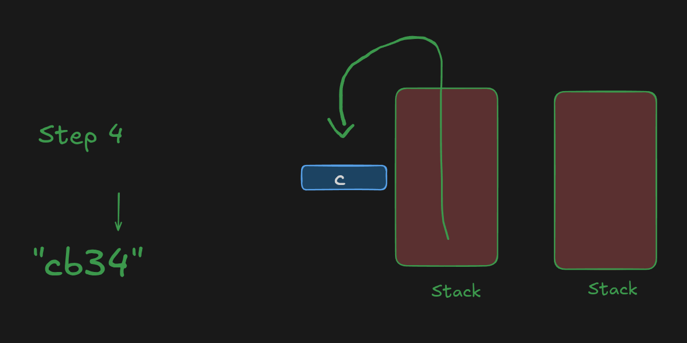
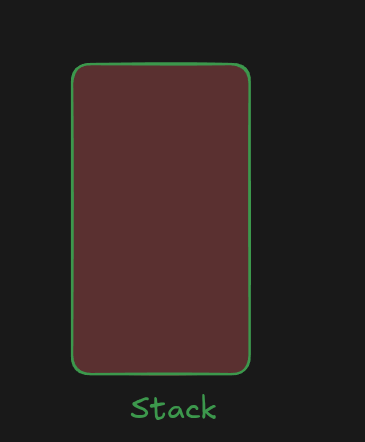

# Intuition

You are given a string `s` containing lowercase English letters and digits.

Whenever we find a **digit**, we need to remove:

1. The digit itself.
2. The closest English letter to its left.

To efficiently keep track of the previous characters, we can use a **Stack**.

* If the current character is an English letter, push it into the stack.
* If the current character is a digit, pop the top element from the stack because it is the closest English letter to the left.

# Approach

We use a **Stack** to store the English letters.

For every character in the string:

* If it is an English letter, push it into the stack.
* If it is a digit, pop the top element from the stack.

At the end, the stack contains all the remaining characters.

Finally, use `join('')` to convert the stack into a string.

# Dry Run

**Input:**

```text
s = "cb34"
```

Let's process the string character by character.

| Step | Character | Action                | Stack        |
| ---- | --------- | --------------------- | ------------ |
| 1    | `c`       | English letter → Push | `["c"]`      |
| 2    | `b`       | English letter → Push | `["c", "b"]` |
| 3    | `3`       | Digit → Pop `b`       | `["c"]`      |
| 4    | `4`       | Digit → Pop `c`       | `[]`         |

### Step 1





```text
Character = 'c'
```

`c` is an English letter, so we push it.

```text
Stack = ["c"]
```


### Step 2




```text
Character = 'b'
```

`b` is an English letter, so we push it.

```text
Stack = ["c", "b"]
```

### Step 3




```text
Character = '3'
```

`3` is a digit, so we pop the top element.

```text
Stack = ["c"]
```

Here, `b` is removed because it is the closest English letter to the left of `3`.

### Step 4




```text
Character = '4'
```

`4` is a digit, so we pop again.


```text
Stack = []
```

Here, `c` is removed because it is the closest English letter to the left of `4`.

### Final Result




```text
Stack = []
```

Therefore:

```text
Output = ""
```

# Complexity

* **Time complexity:** `O(n)` — We traverse the string once.
* **Space complexity:** `O(n)` — In the worst case, all characters can be stored in the stack.

# Code

```javascript []
/**
 * @param {string} s
 * @return {string}
 */
var clearDigits = function (s) {
    const stack = [];

    for (const char of s) {
        if (isNaN(char)) {
            stack.push(char);
        } else {
            stack.pop();
        }
    }

    return stack.join('');
};
```


```python []
class Solution:
    def clearDigits(self, s: str) -> str:
        stack = []

        for char in s:
            if char.isalpha():
                stack.append(char)
            else:
                stack.pop()

        return ''.join(stack)
```

