## Implement Stack using Two Queues | Simple JavaScript Solution | LIFO from FIFO


## Problem Understanding

The question asks us to **implement a Stack using Queues**.

We already know that a **Stack** follows **LIFO (Last In, First Out)**, while a **Queue** follows **FIFO (First In, First Out)**.

Our task is to **build a Stack**, but we are **not allowed to use Stack operations directly**. Instead, we have to use **one or two Queues** and only perform the operations that a normal Queue supports, such as:

* Add an element to the **back** of the Queue
* Remove an element from the **front** of the Queue
* Check the **front** element
* Check whether the Queue is **empty**

The main problem is that Stack and Queue work in opposite ways.

For example, if we push:

```text
push(10)
push(20)
push(30)
```

A Stack should behave like:

```text
        TOP
         ↓
       [30]
       [20]
       [10]
```

So:

```text
pop() → 30
```

because `30` was inserted last.

However, a Queue naturally looks like:

```text
FRONT              BACK
  ↓                  ↓
[10] [20] [30]
```

and removing from a Queue gives:

```text
remove() → 10
```

because `10` was inserted first.

Therefore, the main challenge is:

> **How can we use only Queue operations to make a Queue behave like a Stack?**

We solve this by **rearranging the elements after every `push()`** so that the **newest element is always placed at the front of our main Queue**.

For example, after:

```text
push(10)
push(20)
push(30)
```

we arrange the Queue as:

```text
FRONT
  ↓
[30] [20] [10]
```

Now the Queue's **front** represents the Stack's **top**:

```text
Queue Front = Stack Top
```

So we can implement the Stack operations using Queue operations:

```text
push(x)  → rearrange the Queues so x comes to the front
pop()    → remove the front of the Queue
top()    → return the front of the Queue
empty()  → check whether the Queue is empty
```


When we perform `pop()`, we need:

```text
pop() → 30
```

because `30` was inserted last.

But a Queue works differently:

```text
Queue:

FRONT             BACK
  ↓                 ↓
[10] [20] [30]
```

If we remove an element from the Queue, we can only remove it from the **front**:

```text
remove → 10
```

So the problem is:

```text
Stack wants:

[30] [20] [10]
  ↑
 TOP


Queue naturally gives:

[10] [20] [30]
  ↑
 FRONT
```

We need to somehow **rearrange the Queue** so that the element that was inserted last always comes to the front.

That way:

```text
Queue Front = Stack Top
```

We can then use the Queue to behave like a Stack.

---

# Approach

We will use **two Queues**, `q1` and `q2`.

The main idea is:

> **After every `push()`, keep the newest element at the front of `q1`.**

For example, after:

```text
push(10)
push(20)
push(30)
```

we want:

```text
q1:

FRONT
  ↓
[30] [20] [10]
```

Now `q1` behaves like our Stack:

```text
STACK

TOP
 ↓
[30]
[20]
[10]
```

Therefore:

* `push()` → rearrange the elements
* `pop()` → remove the front of `q1`
* `top()` → return the front of `q1`
* `empty()` → check whether `q1` is empty

---

# Algorithm


The main goal is to **implement Stack behavior using only Queue operations**.

We know:

* **Stack → LIFO** → Last In, First Out
* **Queue → FIFO** → First In, First Out

So our problem is to make the Queue behave like a Stack.

---

## 1. Data Structures We Will Use

We create two Queues:

```text
q1
q2
```
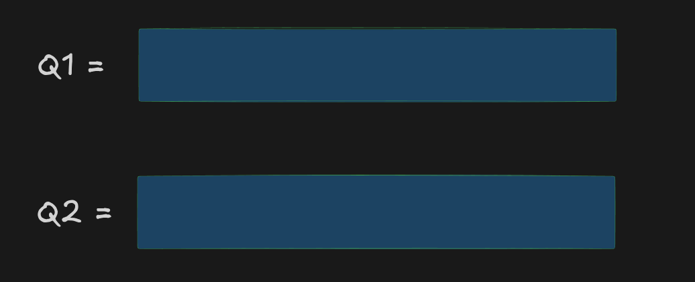


### Why two Queues?

We need a second Queue as a **temporary/helper Queue**.

A Queue only allows us to:

```text
Add → Back
Remove → Front
```

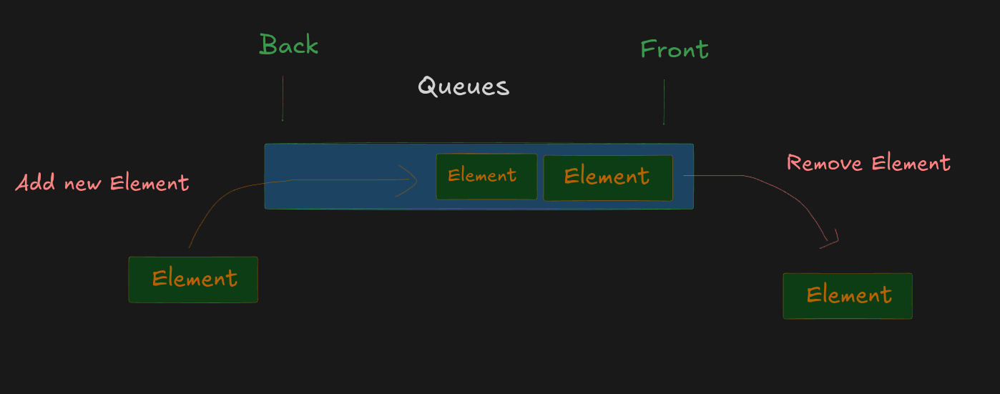


It does **not** allow us to directly insert something at the front.

Therefore, when a new element arrives, we use `q2` to rearrange the elements.


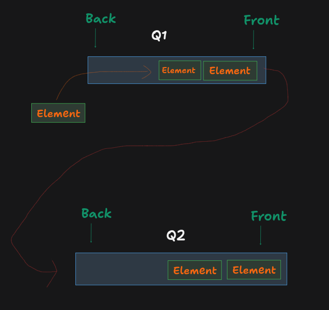


---

# 2. Main Rule

We maintain one very important rule throughout the algorithm:


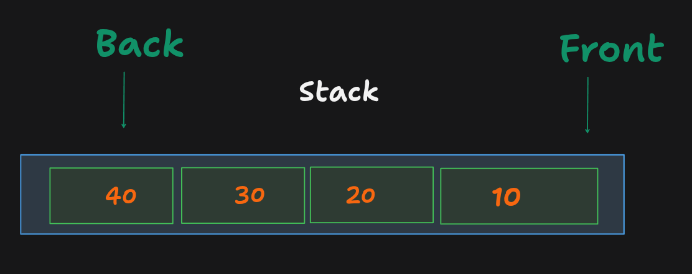


> **The front of `q1` must always represent the top of the Stack.**


For example:


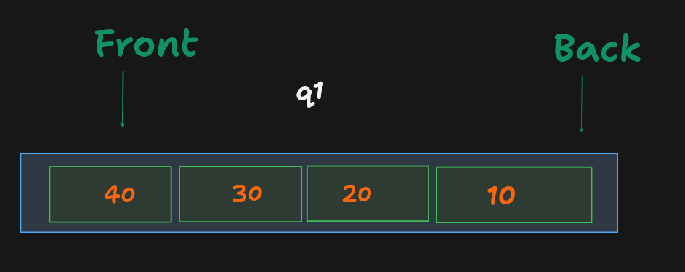


We treat it as:

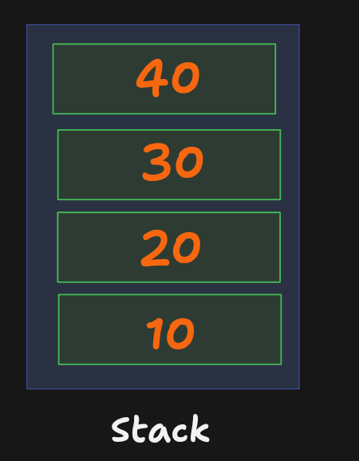


Therefore:

```text
q1.front = Stack.top
```

Once we maintain this rule, `pop()` and `top()` become very easy.

---

# 3. Algorithm for `push(x)`

This is the most important operation.

Suppose our Stack currently contains:

```text
10
20
30
```

and we want:

```text
push(40)
```

Before the operation, our main Queue should already be arranged like:

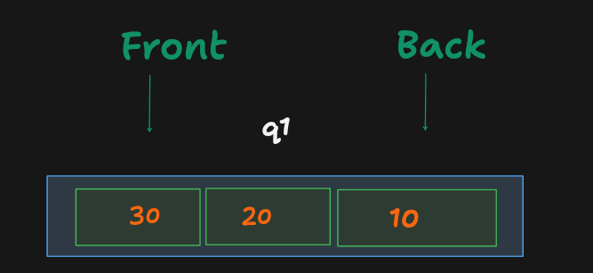


because `30` is currently the Stack's top.

We want to get:


---

## Step 1 — Put the new element into `q2`


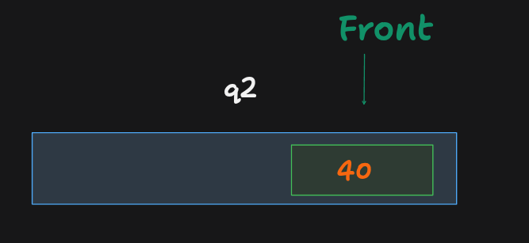


First, add `40` to the empty `q2`.


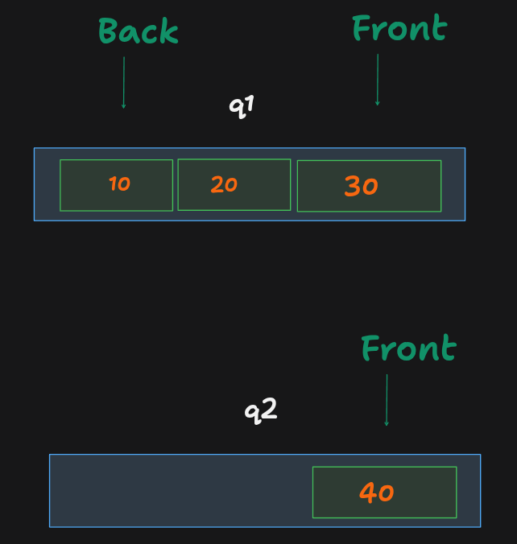


### Why do we put `40` first?

Because `40` is the newest element.

In a Stack:

```text
push(40)
```

means `40` must become the new top.

So we want `40` to become the **front of our final Queue**.


---

# 4. Step 2 — Move all elements from `q1` to `q2`


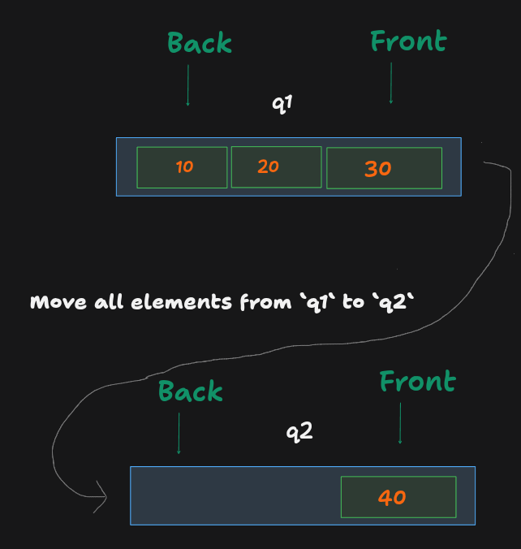


Now we repeatedly remove the **front** of `q1` and add it to the **back** of `q2`.

We continue until `q1` becomes empty.

### Move `30`

Remove `30` from the front of `q1`:

```text
q1 = [20] [10]
```


Add it to the back of `q2`:

```text
q2 = [40] [30]
```

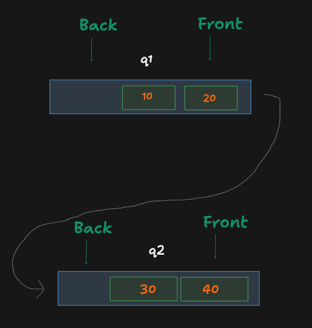


---

### Move `20`

Remove `20` from the front of `q1`:

```text
q1 = [10]
```

Add it to the back of `q2`:

```text
q2 = [40] [30] [20]
```

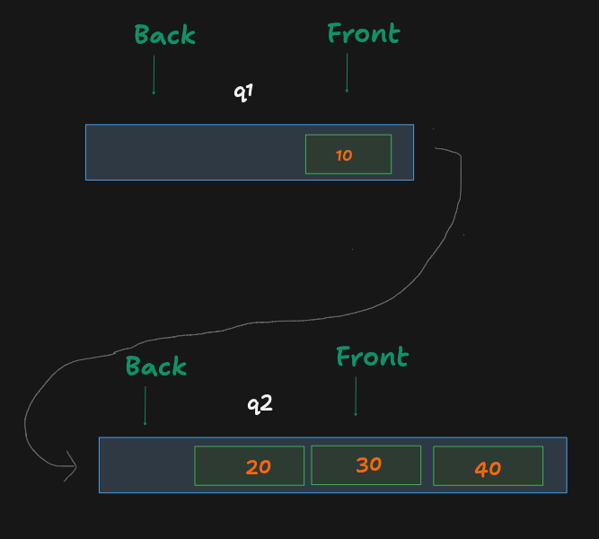


---

### Move `10`

Remove `10` from the front of `q1`:

```text
q1 = []
```

Add it to the back of `q2`:

```text
q2 = [40] [30] [20] [10]
```

Now `q1` is empty.

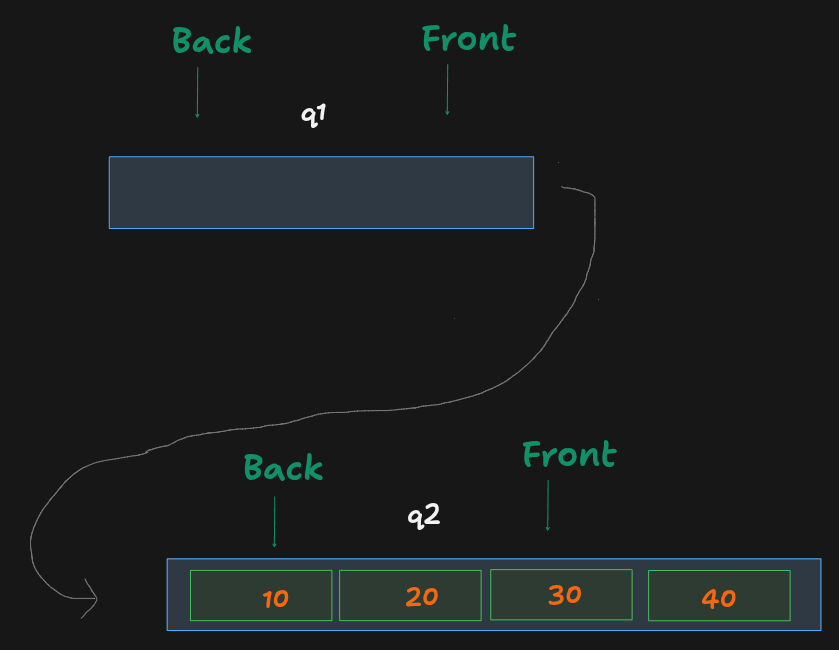


---

# 5. Step 3 — Swap `q1` and `q2`

Currently:

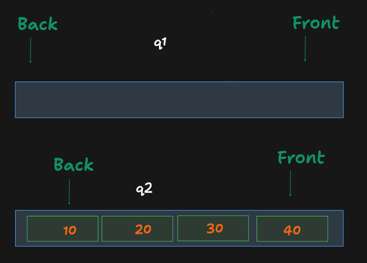


But we want `q1` to remain our **main Queue**.

So we swap them:


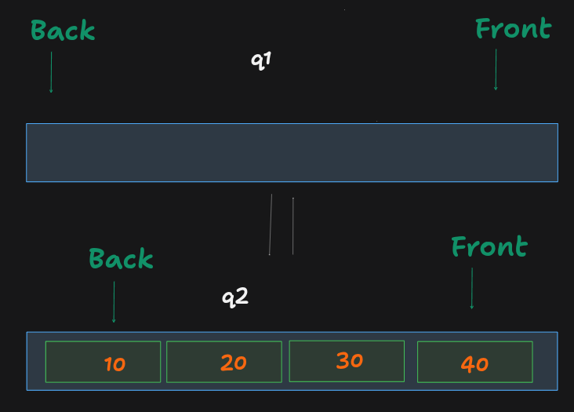


Now our rule is maintained:

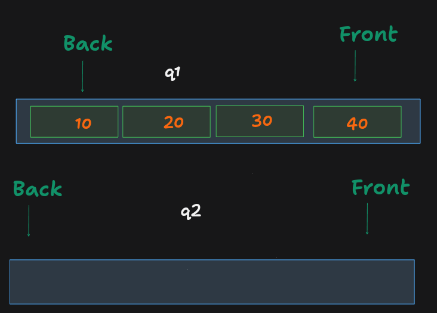


Therefore:

```text
Stack:

TOP
 ↓
[40]
[30]
[20]
[10]
```

`40` is now the Stack's top.

---

# 6. Complete `push()` Algorithm

Therefore, whenever `push(x)` is called:

### Algorithm

```text
1. Add x to q2.

2. While q1 is not empty:
      a. Remove the front element from q1.
      b. Add that element to the back of q2.

3. Swap q1 and q2.

4. Now q1 contains the elements in Stack order.
```

Or simply:

```text
push(x):

    q2.push(x)

    while q1 is not empty:
        q2.push(q1.popFront())

    swap(q1, q2)
```

---

# 7. Algorithm for `pop()`

Now `pop()` is very easy.

Remember our main rule:

```text
q1.front = Stack.top
```

Suppose:

```text
q1:

FRONT
  ↓
[40] [30] [20] [10]
```

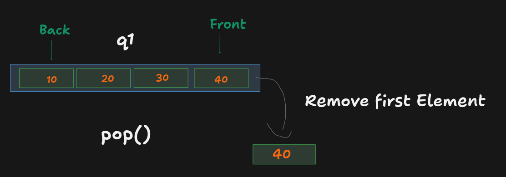


The Stack's top is `40`.

A Stack's `pop()` should remove `40`.

A Queue can remove its front using a standard Queue operation.

So:

```text
pop()
```

means:

```text
Remove q1.front
```

Result:

```text
return 40
```

After removing:

```text
q1 = [30] [20] [10]
```

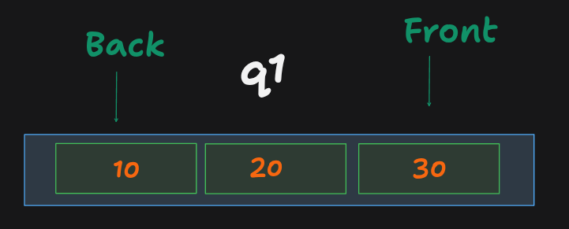


### Algorithm

```text
pop():

    Remove and return the front element of q1
```

---

# 8. Algorithm for `top()`

`top()` should return the Stack's top **without removing it**.

Again:

```text
q1.front = Stack.top
```

Suppose:

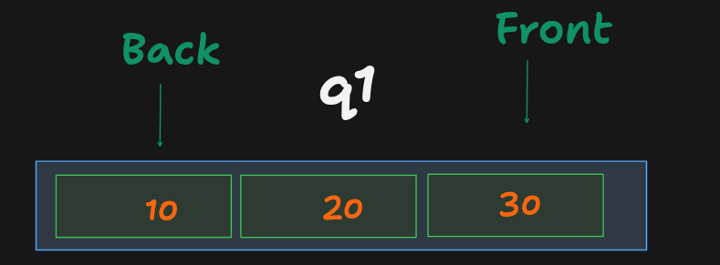


Then:

```text
top() →30
```

But the Queue must remain unchanged:


### Algorithm

```text
top():

    Return the front element of q1
```

---

# 9. Algorithm for `empty()`

A Stack is empty when it contains no elements.

Since all our actual elements are maintained in `q1`, we only need to check whether `q1` is empty.

```text
q1 = []
```

Then:

```text
empty() → true
```

Otherwise:

```text
q1 = [10]
```

Then:

```text
empty() → false
```

### Algorithm

```text
empty():

    If q1 has no elements:
        return true
    Otherwise:
        return false
```

---

# 10. Complete Algorithm

Now combine all four operations.

## `push(x)`

```text
1. Insert x into q2.
2. Move every element from q1 to q2:
      - remove from q1's front
      - add to q2's back
3. Swap q1 and q2.
```

## `pop()`

```text
1. Remove the front element of q1.
2. Return that element.
```

## `top()`

```text
1. Look at the front element of q1.
2. Return it.
3. Do not remove it.
```

## `empty()`

```text
1. Check whether q1 is empty.
2. Return true if empty.
3. Otherwise return false.
```

---

# 11. Complete Example

Let's perform:

```text
push(10)
push(20)
push(30)
push(40)
pop()
top()
empty()
```

---

## Initially

```text
q1 = []
q2 = []
```

---

## `push(10)`

Put `10` into `q2`:

```text
q2 = [10]
```

`q1` is empty.

Swap:

```text
q1 = [10]
q2 = []
```

---

## `push(20)`

Put `20` into `q2`:

```text
q2 = [20]
```

Move `10`:

```text
q1 = []
q2 = [20] [10]
```

Swap:

```text
q1 = [20] [10]
q2 = []
```

---

## `push(30)`

Put `30` into `q2`:

```text
q2 = [30]
```

Move `20`:

```text
q2 = [30] [20]
```

Move `10`:

```text
q2 = [30] [20] [10]
```

Swap:

```text
q1 = [30] [20] [10]
q2 = []
```

---

## `push(40)`

Put `40` into `q2`:

```text
q2 = [40]
```

Move `30`:

```text
q2 = [40] [30]
```

Move `20`:

```text
q2 = [40] [30] [20]
```

Move `10`:

```text
q2 = [40] [30] [20] [10]
```

Swap:

```text
q1 = [40] [30] [20] [10]
q2 = []
```

Now:

```text
        STACK

         TOP
          ↓
        [40]
        [30]
        [20]
        [10]
```

---

## `pop()`

Remove the front of `q1`:

```text
40
```

Return:

```text
40
```

Now:

```text
q1 = [30] [20] [10]
```

---

## `top()`

Front of `q1`:

```text
30
```

Return:

```text
30
```

But don't remove it.

```text
q1 = [30] [20] [10]
```

---

## `empty()`

```text
q1 = [30] [20] [10]
```

It is not empty.

Return:

```text
false
```

---

# 12. Algorithm in One Picture

```text
                 push(40)
                    ↓
        ┌──────────────────────┐
        │                      │
        │       q1             │
        │ [30] [20] [10]       │
        │                      │
        └──────────────────────┘
                    │
                    │
                    ↓
              Put 40 in q2
                    │
                    ↓
             q2 = [40]
                    │
                    ↓
        Move q1 → q2 one by one
                    │
                    ↓
        q2 = [40] [30] [20] [10]
                    │
                    ↓
              Swap q1, q2
                    │
                    ↓
        q1 = [40] [30] [20] [10]
                    │
                    ↓
             Queue Front
                    =
               Stack Top
```

---

# 13. Why This Algorithm Works

The algorithm works because after every `push()` we guarantee:

```text
q1.front = newest element
```

The newest element is exactly what a Stack needs at its top.

For example:

```text
push(10)

q1 = [10]


push(20)

q1 = [20] [10]


push(30)

q1 = [30] [20] [10]


push(40)

q1 = [40] [30] [20] [10]
```

Therefore:

```text
q1.front
   ↓
[40] [30] [20] [10]
   ↓
Stack Top
```

So even though `q1` is technically a Queue, its elements are arranged so that it **behaves like a Stack**.

---

# 14. Why `push()` Is Expensive

Notice what happens when we push a new element.

For:

```text
q1 = [30] [20] [10]
```

and:

```text
push(40)
```

we have to move:

```text
30
20
10
```

from `q1` to `q2`.

If there are `n` elements, we move `n` elements.

Therefore:

```text
push() → O(n)
```

But:

```text
pop() → O(1)
top() → O(1)
empty() → O(1)
```

because these operations only work with the front of `q1`.

---


# Dry Run

Let's take:

```text
push(10)
push(20)
push(30)
top()
pop()
top()
pop()
empty()
```

Initially:

```text
q1 = []
q2 = []
```

---

## 1. `push(10)`

Put `10` into `q2`:

```text
q2 = [10]
```

`q1` is empty, so nothing needs to be moved.

Swap:

```text
q1 = [10]
q2 = []
```

Return:

```text
null
```

---

## 2. `push(20)`

Put `20` into `q2`:

```text
q1 = [10]
q2 = [20]
```

Move `10`:

```text
q1 = []
q2 = [20] [10]
```

Swap:

```text
q1 = [20] [10]
q2 = []
```

Return:

```text
null
```

---

## 3. `push(30)`

Put `30` into `q2`:

```text
q1 = [20] [10]
q2 = [30]
```

Move `20`:

```text
q1 = [10]
q2 = [30] [20]
```

Move `10`:

```text
q1 = []
q2 = [30] [20] [10]
```

Swap:

```text
q1 = [30] [20] [10]
q2 = []
```

Return:

```text
null
```

Now our Queue is behaving like a Stack:

```text
        STACK

         TOP
          ↓
        [30]
        [20]
        [10]
```

---

## 4. `top()`


Current:


Return the front:

```text
top() → 30
```

Nothing is removed.

```text
q1 = [30] [20] [10]
```

---

## 5. `pop()`

Current:

```text
q1 = [30] [20] [10]
      ↑
```

Remove the front:

```text
pop() → 30
```

Now:

```text
q1 = [20] [10]
```

---

## 6. `top()`

Current:

```text
q1 = [20] [10]
      ↑
```

Return:

```text
top() → 20
```

Queue remains:

```text
q1 = [20] [10]
```

---

## 7. `pop()`

Remove the front:

```text
pop() → 20
```

Now:

```text
q1 = [10]
```

---

## 8. `empty()`

Current:

```text
q1 = [10]
```

It is not empty.

Therefore:

```text
empty() → false
```

---

# Dry Run Table

| Operation  | `q1`           | `q2` | Return  |
| ---------- | -------------- | ---- | ------- |
| `push(10)` | `[10]`         | `[]` | `null`  |
| `push(20)` | `[20, 10]`     | `[]` | `null`  |
| `push(30)` | `[30, 20, 10]` | `[]` | `null`  |
| `top()`    | `[30, 20, 10]` | `[]` | `30`    |
| `pop()`    | `[20, 10]`     | `[]` | `30`    |
| `top()`    | `[20, 10]`     | `[]` | `20`    |
| `pop()`    | `[10]`         | `[]` | `20`    |
| `empty()`  | `[10]`         | `[]` | `false` |

Final output:

```text
[null, null, null, null, 30, 30, 20, 20, false]
```

---

# Code

```javascript
var MyStack = function () {
    this.q1 = [];
    this.q2 = [];
};

/**
 * Push element x onto stack.
 *
 * @param {number} x
 * @return {void}
 */
MyStack.prototype.push = function (x) {

    // Put the new element into q2 first.
    this.q2.push(x);

    // Move all old elements behind the new element.
    while (this.q1.length > 0) {
        this.q2.push(this.q1.shift());
    }

    // q2 now has the correct Stack order.
    // Make q2 the main queue.
    let temp = this.q1;
    this.q1 = this.q2;
    this.q2 = temp;
};

/**
 * Remove the element on top of the stack.
 *
 * @return {number}
 */
MyStack.prototype.pop = function () {
    return this.q1.shift();
};

/**
 * Return the element on top of the stack.
 *
 * @return {number}
 */
MyStack.prototype.top = function () {
    return this.q1[0];
};

/**
 * Returns whether the stack is empty.
 *
 * @return {boolean}
 */
MyStack.prototype.empty = function () {
    return this.q1.length === 0;
};
```

# Complexity

There are `n` elements in the Queue.

### `push()`

We move all existing elements from `q1` to `q2`.

```text
O(n)
```

### `pop()`

We remove only the front element.

```text
O(1)
```

### `top()`

We directly access the front element.

```text
O(1)
```

### `empty()`

We only check the length.

```text
O(1)
```

### Space Complexity

We store all `n` elements in the two Queues.

```text
O(n)
```

---

# The Main Idea to Remember

Don't try to remember the code first. Remember this:

```text
STACK
LIFO
 ↓
Last element must come out first
```

But:

```text
QUEUE
FIFO
 ↓
First element normally comes out first
```

So we **rearrange the Queue after every `push()`**:

```text
push(10)

[10]


push(20)

[20] [10]


push(30)

[30] [20] [10]
  ↑
front
```

Now:

```text
Queue Front = Stack Top
```

Therefore:

```text
pop()  → remove Queue front
top()  → see Queue front
```

**In one sentence:**

> We implement the Stack by using two Queues and rearranging the elements after every `push()` so that the newest element always stays at the front of `q1`, allowing the Queue's front to behave like the Stack's top.
