# Min Stack — Two Stack Approach | O(1) Time Complexity


## Intuition

The problem asks us to design a **Min Stack** that supports:

```text
push()
pop()
top()
getMin()
```

The important requirement is:

> **Every operation must work in O(1) time.**

The normal Stack operations are easy:

```text
push() → O(1)
pop()  → O(1)
top()  → O(1)
```

The difficult operation is:

```text
getMin()
```

We need to return the **smallest element currently present in the Stack**, but we cannot search the entire Stack because that would take `O(n)`.

### 💡 Main Idea

We use **two Stacks**:

```text
stack
minStack
```

### `stack`

This is our **normal Stack**.

It stores all the values:

```text
stack:

TOP
 ↓
[-3]
[ 0]
[-2]
```

### `minStack`

This is our **special helper Stack**.

It keeps track of the **minimum value at every level of the main Stack**.

For example:

```text
stack:      [-3] [0] [-2]

minStack:   [-3] [-2] [-2]
```

The important rule is:

> **The top of `minStack` always contains the minimum value of the entire `stack`.**

Therefore:

```text
getMin()
   ↓
minStack.top()
```

can return the minimum immediately in:

```text
O(1)
```

---

# Approach

We maintain two Stacks:

```javascript
this.stack = [];
this.minStack = [];
```

Think of them as:

```text
stack     → stores actual values
minStack  → stores the minimum value for each position
```

The two Stacks always have the **same size**.

---

# 1. Understanding `push(value)`

When we push a new value, we push it into the normal `stack`.

For example:

```text
push(-2)
```

We get:

```text
stack:

[-2]
```

Since `-2` is currently the only element, it is also the minimum.

So:

```text
minStack:

[-2]
```

Therefore:

```text
stack    = [-2]
minStack = [-2]
```

---

## Now `push(0)`

First, put `0` into the normal Stack:

```text
stack:

[0]  ← TOP
[-2]
```

Now we need to determine the minimum for this new level.

The previous minimum was:

```text
minStack.top() = -2
```

Compare:

```text
value = 0
previous minimum = -2
```

The smaller value is:

```text
-2
```

So we push `-2` into `minStack`:

```text
stack:

[ 0]
[-2]


minStack:

[-2]
[-2]
```

Notice something important:

> We don't store only the values that are smaller than the previous minimum.

We store the **current minimum at every level**.

---

# 2. Why Do We Push the Minimum Every Time?

This is a very important part of this solution.

Suppose:

```text
push(-2)
push(0)
push(-3)
```

Our Stacks become:

```text
stack:

[-3]
[ 0]
[-2]
```

and:

```text
minStack:

[-3]  ← current minimum
[-2]
[-2]
```

Now:

```text
getMin() → -3
```

Everything is fine.

But now suppose we:

```text
pop()
```

We remove `-3`.

The main Stack becomes:

```text
stack:

[0]
[-2]
```

What is the minimum now?

```text
-2
```

Because we maintained the minimum at every level, `minStack` also becomes:

```text
minStack:

[-2]
[-2]
```

So we immediately know:

```text
getMin() → -2
```

No searching is required.

---

# 3. Why Can't We Push Only When We Find a New Minimum?

Suppose we did this:

```text
push(-2)
push(0)
push(-3)
```

and only stored a value in `minStack` when it became a new minimum.

We might get:

```text
stack:

[-3]
[ 0]
[-2]


minStack:

[-3]
[-2]
```

Now `-3` is the minimum.

But after:

```text
pop()
```

we remove `-3`.

The new minimum is:

```text
-2
```

We could potentially manage this with a different design, but this code uses a much simpler invariant:

> **For every element in `stack`, `minStack` stores the minimum of the Stack up to that point.**

Therefore both Stacks always have the same number of elements.

This makes `pop()` extremely simple:

```javascript
this.stack.pop();
this.minStack.pop();
```

---

# 4. `push(value)` Algorithm

When `push(value)` is called:

### Step 1

Push `value` into the normal Stack.

```javascript
this.stack.push(value);
```

### Step 2

Check whether `minStack` is empty.

If it is empty:

```javascript
this.minStack.push(value);
```

because the first value is automatically the minimum.

Otherwise:

```text
new minimum =
minimum(value, previous minimum)
```

We get the previous minimum using:

```javascript
this.minStack[this.minStack.length - 1]
```

Then:

```javascript
const min = Math.min(
    value,
    this.minStack[this.minStack.length - 1]
);
```

Finally, push that minimum into `minStack`:

```javascript
this.minStack.push(min);
```

---

# 5. Dry Run of `push()`

Let's use the problem's example:

```text
push(-2)
push(0)
push(-3)
```


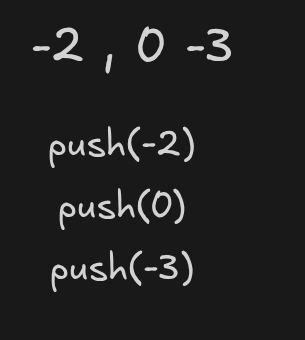

---

## `push(-2)`

Before:

```text
stack = []
minStack = []
```


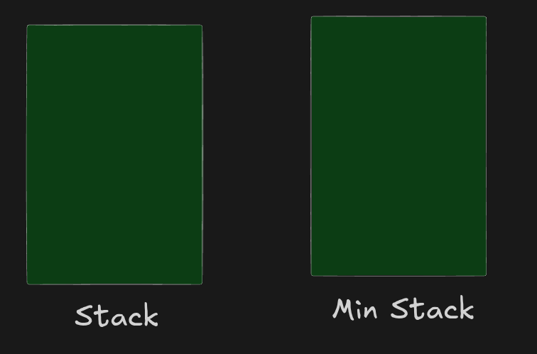


Push `-2`:

```text
stack = [-2]
```

`minStack` is empty, so:

```text
minStack = [-2]
```

Final:

```text
stack:

[-2]


minStack:

[-2]
```


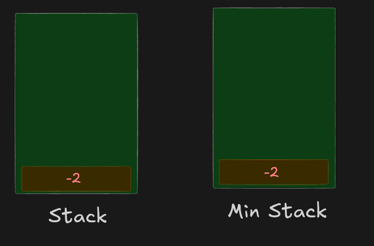


Minimum:

```text
-2
```


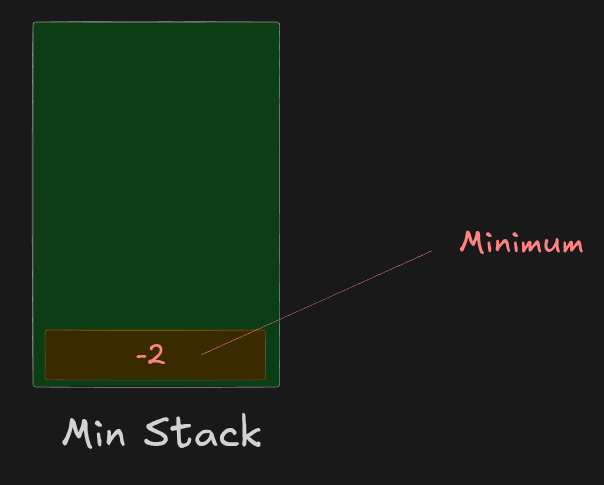


---

## `push(0)`

Current:

```text
stack:

[-2]

minStack:

[-2]
```


Push `0`:

```text
stack:

[0]
[-2]
```


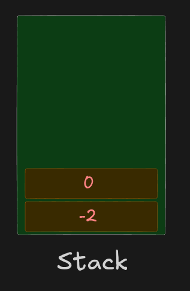


Previous minimum:

```text
-2
```


Compare:

```text
min(0, -2) = -2
```

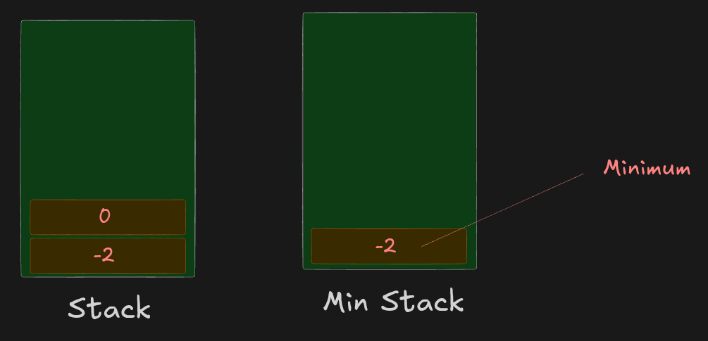


Push `-2` into `minStack`:

```text
stack:

[ 0]
[-2]
```


```text
minStack:

[-2]
[-2]
```


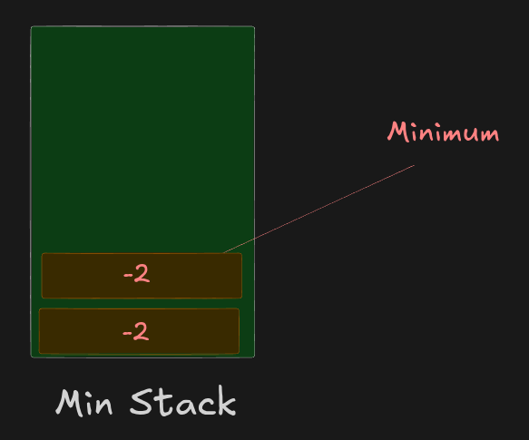


Current minimum:

```text
-2
```

---

## `push(-3)`

Current:

```text
stack:

[ 0]
[-2]
```

and:

```text
minStack:

[-2]
[-2]
```


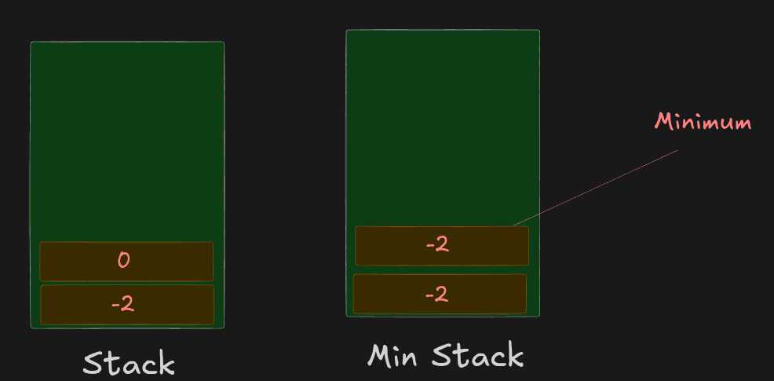


Push `-3`:

```text
stack:

[-3]
[ 0]
[-2]
```


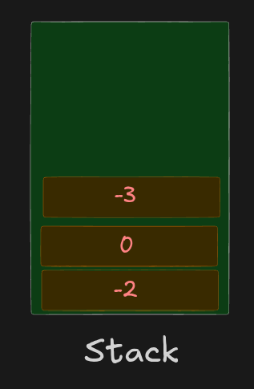


Previous minimum:

```text
-2
```


Compare:

```text
min(-3, -2) = -3
```


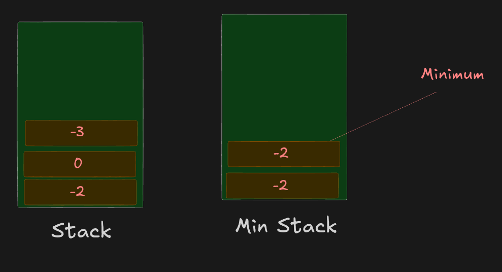


Push `-3`:

```text
minStack:

[-3]
[-2]
[-2]
```


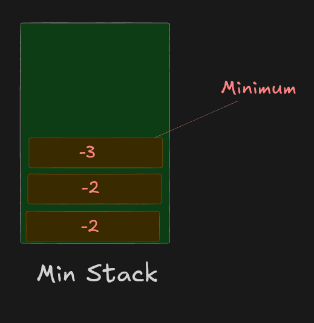


Now:

```text
minStack.top() = -3
```


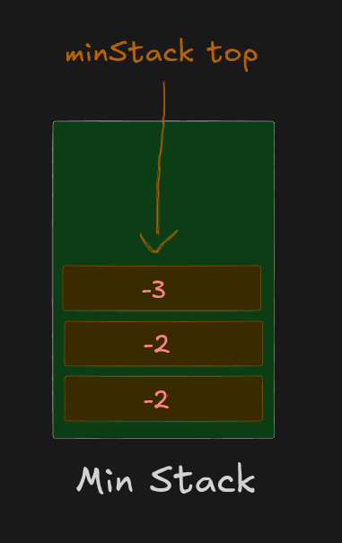


Therefore:

```text
getMin() → -3
```

---

# 6. `pop()`

This is another important part of the approach.

Whenever we remove an element from the main Stack:

```javascript
this.stack.pop();
```

we also remove the corresponding minimum from `minStack`:

```javascript
this.minStack.pop();
```

Why?

Because both Stacks represent the same number of levels.

For example:

```text
stack:

[-3] ← remove
[ 0]
[-2]


minStack:

[-3] ← remove
[-2]
[-2]
```


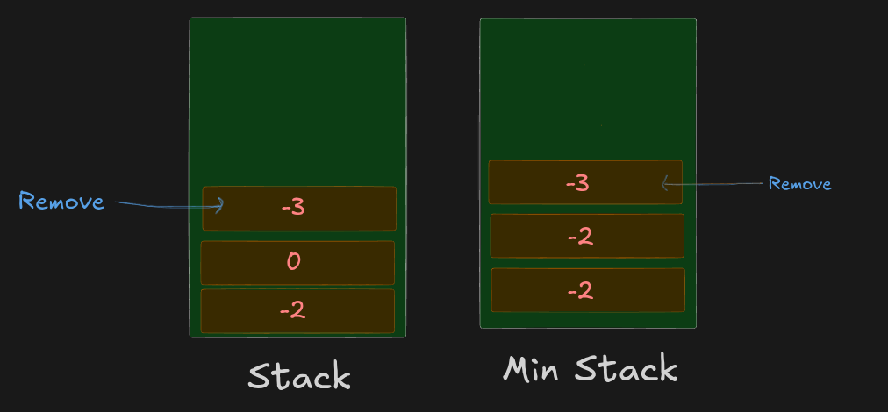


After `pop()`:

```text
stack:

[0]
[-2]


minStack:

[-2]
[-2]
```

Now the top of `minStack` tells us the current minimum:

```text
getMin() → -2
```

---

# 7. `top()`

The `top()` operation only needs to look at the top of the normal Stack.

```javascript
return this.stack[this.stack.length - 1];
```

For example:

```text
stack:

[0] ← TOP
[-2]
```

Therefore:

```text
top() → 0
```

`minStack` is not needed for `top()`.

---

# 8. `getMin()`

This is where our second Stack is useful.

Because of our invariant:

> **The top of `minStack` is always the minimum value of the entire `stack`.**

So:

```javascript
return this.minStack[this.minStack.length - 1];
```

For:

```text
minStack:

[-2] ← TOP
[-2]
```

we immediately get:

```text
getMin() → -2
```

There is no loop and no searching.

Therefore:

```text
getMin() → O(1)
```

---

# Core Invariant

The most important thing to remember in this solution is:

> **At every position, `minStack` stores the minimum value of all elements from the bottom of `stack` up to that position.**

For example:

```text
stack:

[ 7]  ← TOP
[ 3]
[ 5]
[ 2]
[ 6]
```

Then:

```text
minStack:

[ 2]  ← minimum for 7,3,5,2,6
[ 2]  ← minimum for 3,5,2,6
[ 2]  ← minimum for 5,2,6
[ 2]  ← minimum for 2,6
[ 6]  ← minimum for 6
```

So:

```text
minStack.top() = 2
```

Therefore:

```text
getMin() → 2
```

---

# Complete Algorithm

## `push(value)`

```text
1. Push value into stack.
2. If minStack is empty:
      push value into minStack.
3. Otherwise:
      get the previous minimum from minStack.
      compare value with previous minimum.
      calculate the new minimum.
      push the new minimum into minStack.
```

---

## `pop()`

```text
1. Remove the top element from stack.
2. Remove the top element from minStack.
```

Both stacks must always remain synchronized.

---

## `top()`

```text
1. Return the top element of stack.
2. Do not modify either stack.
```

---

## `getMin()`

```text
1. Return the top element of minStack.
2. Do not modify either stack.
```

Because `minStack.top()` always represents the current minimum.

---

# Complete Dry Run

Using the official operations:

```text
push(-2)
push(0)
push(-3)
getMin()
pop()
top()
getMin()
```

### After `push(-2)`

```text
stack:

[-2]


minStack:

[-2]
```

---

### After `push(0)`

```text
stack:

[0]
[-2]


minStack:

[-2]
[-2]
```

---

### After `push(-3)`

```text
stack:

[-3]
[ 0]
[-2]


minStack:

[-3]
[-2]
[-2]
```

---

### `getMin()`

Look at the top of `minStack`:

```text
[-3] ← TOP
```

Return:

```text
-3
```

---

### `pop()`

Remove the top from both:

```text
stack:

[0]
[-2]


minStack:

[-2]
[-2]
```

---

### `top()`

Look at the top of `stack`:

```text
[0] ← TOP
```

Return:

```text
0
```

---

### `getMin()`

Look at the top of `minStack`:

```text
[-2] ← TOP
```

Return:

```text
-2
```

---

# Complexity

| Operation  | Time Complexity | Why?                  |
| ---------- | --------------: | --------------------- |
| `push()`   |        **O(1)** | Push into both Stacks |
| `pop()`    |        **O(1)** | Pop from both Stacks  |
| `top()`    |        **O(1)** | Access the top        |
| `getMin()` |        **O(1)** | Access `minStack` top |

### Space Complexity

We maintain two Stacks, each containing up to `n` elements.

```text
O(n)
```

---

# Code

```javascript
var MinStack = function () {
    // Normal stack: stores all values
    this.stack = [];

    // Min stack: stores the minimum value
    // for every level of the main stack
    this.minStack = [];
};

/**
 * @param {number} value
 * @return {void}
 */
MinStack.prototype.push = function (value) {

    // Push the value into the normal stack
    this.stack.push(value);

    // If this is the first element,
    // it is automatically the minimum
    if (this.minStack.length === 0) {
        this.minStack.push(value);
    } else {

        // Get the previous minimum
        const previousMin =
            this.minStack[this.minStack.length - 1];

        // Find the minimum between:
        // 1. Current value
        // 2. Previous minimum
        const min = Math.min(value, previousMin);

        // Store the current minimum
        this.minStack.push(min);
    }
};

/**
 * @return {void}
 */
MinStack.prototype.pop = function () {

    // Remove the top value from the normal stack
    this.stack.pop();

    // Remove the corresponding minimum
    // from the min stack
    this.minStack.pop();
};

/**
 * @return {number}
 */
MinStack.prototype.top = function () {

    // Return the top value of the normal stack
    return this.stack[this.stack.length - 1];
};

/**
 * @return {number}
 */
MinStack.prototype.getMin = function () {

    // The top of minStack is always
    // the minimum value of the main stack
    return this.minStack[this.minStack.length - 1];
};
```

---

# 🔑 One-Line Idea

> **Use one normal Stack to store values and a second Stack to store the minimum value at every level, so the top of `minStack` always gives the current minimum in O(1).**

The key pattern is:

```text
Normal Stack          Min Stack

[ -3 ] ← TOP          [ -3 ] ← TOP → current minimum
[  0 ]                [ -2 ]
[ -2 ]                [ -2 ]
```

When we `push()`:

```text
new minimum = min(value, previous minimum)
```

When we `pop()`:

```text
pop from BOTH stacks
```

When we call:

```text
top()    → top of stack
getMin() → top of minStack
```

This is why every operation remains **O(1)**.
