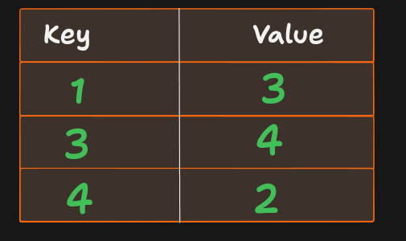
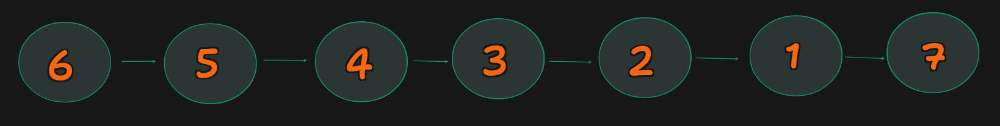

# Intuition

Instead of checking every element to the right each time, we first create a mapping where every number points to its immediate next element in `nums2`.

For each element in `nums1`, we simply follow this chain of "next" elements until we find a value greater than the original number. If we reach the end of the chain without finding one, the answer is `-1`.

This avoids repeatedly searching from the beginning of `nums2` and makes the implementation straightforward.

---


# Idea

Instead of repeatedly searching the array,

we store each element's **immediate next element** inside a **HashMap**.

```
nums2

[1] → [3] → [4] → [2]
```

Create




Now,

```
nextMap.get(1) → 3

nextMap.get(3) → 4

nextMap.get(4) → 2
```

Instead of searching the array,

we simply follow the chain.


# Approach

1. Create a `Map` that stores the immediate right neighbour of every element in `nums2`.

   * Example:

     ```
     nums2 = [1,3,4,2]

     1 → 3
     3 → 4
     4 → 2
     ```

2. Iterate through every number in `nums1`.

3. Starting from that number, repeatedly follow the neighbour chain:

   * If the next value is greater than the original number, store it as the answer.
   * Otherwise, continue following the chain.

4. If the chain ends without finding a greater element, store `-1`.

---

# Complexity

* **Time complexity:** `O(n × m)` in the worst case, where:

  * `n = nums1.length`
  * `m = nums2.length`

  In the worst case, every element in `nums1` may traverse almost the entire neighbour chain.

* **Space complexity:** `O(m)`

  * The map stores one neighbour for each element in `nums2`.

---


# 🧪 Dry Run 

## Input

```text
nums1 = [1,3,5,2,4]

nums2 = [6,5,4,3,2,1,7]
```

---

# Step 1: Build the nextMap

```text
nums2

6 → 5 → 4 → 3 → 2 → 1 → 7
```

HashMap

| Key | Next Value |
| --- | ---------- |
| 6   | 5          |
| 5   | 4          |
| 4   | 3          |
| 3   | 2          |
| 2   | 1          |
| 1   | 7          |

Visual




---

# Step 2: Process every number in nums1

---

# 🔹 Find Answer for 1

## Input

```text
nums1 = [1,3,5,2,4]

nums2 = [6,5,4,3,2,1,7]
```

Start

```text
search = 1
```

Move


```text
1
│
▼
7
```

Compare

```text
7 > 1 ?

✅ Yes
```

Answer

```text
7
```

Current Result

```text
[7]
```

---

### Dry Run Table

| Step | Current | Next | Greater? | Action  |
| ---- | ------- | ---- | -------- | ------- |
| 1    | 1       | 7    | ✅ Yes    | Store 7 |

---

# 🔹 Find Answer for 3

## Input

```text
nums1 = [1,3,5,2,4]

nums2 = [6,5,4,3,2,1,7]
```

Start

```text
search = 3
```

Move


```text
3
│
▼
2
```

Compare

```text
2 > 3 ?

❌ No
```

Continue

```text
2
│
▼
1
```

Compare

```text
1 > 3 ?

❌ No
```

Continue

```text
1
│
▼
7
```

Compare

```text
7 > 3 ?

✅ Yes
```

Answer

```text
7
```

Current Result

```text
[7,7]
```

---

### Dry Run Table

| Step | Current | Next | Greater? | Action  |
| ---- | ------- | ---- | -------- | ------- |
| 1    | 3       | 2    | ❌ No     | Move    |
| 2    | 2       | 1    | ❌ No     | Move    |
| 3    | 1       | 7    | ✅ Yes    | Store 7 |

---

# 🔹 Find Answer for 5

## Input

```text
nums1 = [1,3,5,2,4]

nums2 = [6,5,4,3,2,1,7]
```

Start

```text
search = 5
```

Traversal


```text
5
│
▼
4
```

```text
4 > 5 ?

❌ No
```

↓

```text
4
│
▼
3
```

```text
3 > 5 ?

❌ No
```

↓

```text
3
│
▼
2
```

```text
2 > 5 ?

❌ No
```

↓

```text
2
│
▼
1
```

```text
1 > 5 ?

❌ No
```

↓

```text
1
│
▼
7
```

```text
7 > 5 ?

✅ Yes
```

Answer

```text
7
```

Current Result

```text
[7,7,7]
```

---

### Dry Run Table

| Step | Current | Next | Greater? | Action  |
| ---- | ------- | ---- | -------- | ------- |
| 1    | 5       | 4    | ❌ No     | Move    |
| 2    | 4       | 3    | ❌ No     | Move    |
| 3    | 3       | 2    | ❌ No     | Move    |
| 4    | 2       | 1    | ❌ No     | Move    |
| 5    | 1       | 7    | ✅ Yes    | Store 7 |

---

# 🔹 Find Answer for 2

## Input

```text
nums1 = [1,3,5,2,4]

nums2 = [6,5,4,3,2,1,7]
```

Start

```text
search = 2
```

Traversal


```text
2
│
▼
1
```

```text
1 > 2 ?

❌ No
```

Continue

```text
1
│
▼
7
```

```text
7 > 2 ?

✅ Yes
```

Answer

```text
7
```

Current Result

```text
[7,7,7,7]
```

---

### Dry Run Table

| Step | Current | Next | Greater? | Action  |
| ---- | ------- | ---- | -------- | ------- |
| 1    | 2       | 1    | ❌ No     | Move    |
| 2    | 1       | 7    | ✅ Yes    | Store 7 |

---

# 🔹 Find Answer for 4

## Input

```text
nums1 = [1,3,5,2,4]

nums2 = [6,5,4,3,2,1,7]
```

Start

```text
search = 4
```

Traversal


```text
4
│
▼
3
│
▼
2
│
▼
1
│
▼
7
```

Comparisons

```text
3 > 4 ? ❌

2 > 4 ? ❌

1 > 4 ? ❌

7 > 4 ? ✅
```

Answer

```text
7
```

Current Result

```text
[7,7,7,7,7]
```

---

### Dry Run Table

| Step | Current | Next | Greater? | Action  |
| ---- | ------- | ---- | -------- | ------- |
| 1    | 4       | 3    | ❌ No     | Move    |
| 2    | 3       | 2    | ❌ No     | Move    |
| 3    | 2       | 1    | ❌ No     | Move    |
| 4    | 1       | 7    | ✅ Yes    | Store 7 |

---

# Final Output

```text
[7,7,7,7,7]
```

---

# Complete Traversal Summary

| nums1 Element | Traversal Path        | Next Greater |
| ------------- | --------------------- | ------------ |
| 1             | 1 → 7                 | 7            |
| 3             | 3 → 2 → 1 → 7         | 7            |
| 5             | 5 → 4 → 3 → 2 → 1 → 7 | 7            |
| 2             | 2 → 1 → 7             | 7            |
| 4             | 4 → 3 → 2 → 1 → 7     | 7            |

---


# Code

```javascript
/**
 * @param {number[]} nums1
 * @param {number[]} nums2
 * @return {number[]}
 */
var nextGreaterElement = function (nums1, nums2) {
    const nextMap = new Map();
    const result = [];

    // Build a map: current element -> immediate next element
    let current = 0;
    let next = 1;

    while (next < nums2.length) {
        nextMap.set(nums2[current], nums2[next]);
        current++;
        next++;
    }

    // Find the next greater element for every number in nums1
    for (const num of nums1) {
        let search = num;
        let found = false;

        while (nextMap.has(search)) {
            const nextVal = nextMap.get(search);

            if (nextVal > num) {
                result.push(nextVal);
                found = true;
                break;
            }

            search = nextVal;
        }

        if (!found) {
            result.push(-1);
        }
    }

    return result;
};
```

### Note

This solution **passes LeetCode**, but it is **not the optimal approach**.

* **This approach:** `O(n × m)` worst-case time.
* **Optimal approach (Monotonic Stack):** `O(n + m)` time.

The official interview-preferred solution uses a **Monotonic Decreasing Stack**, which preprocesses the next greater element for every value in `nums2` before answering queries from `nums1`.
