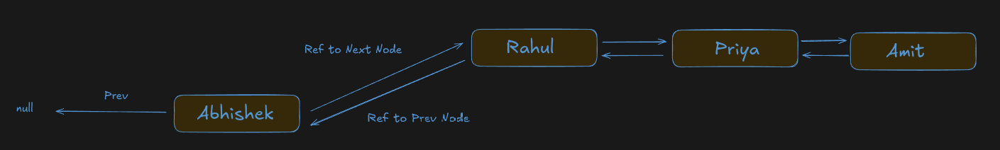
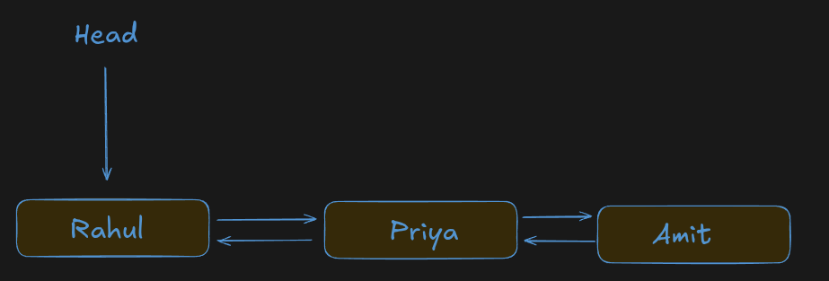
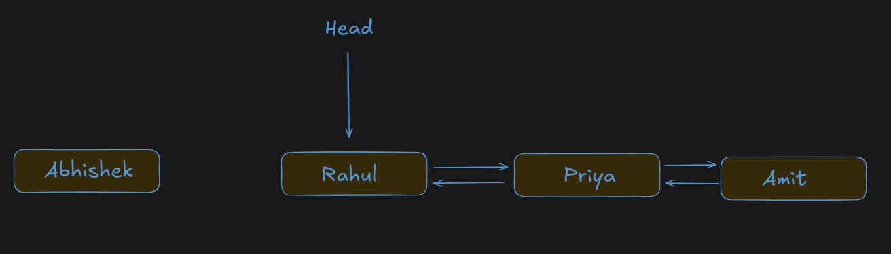
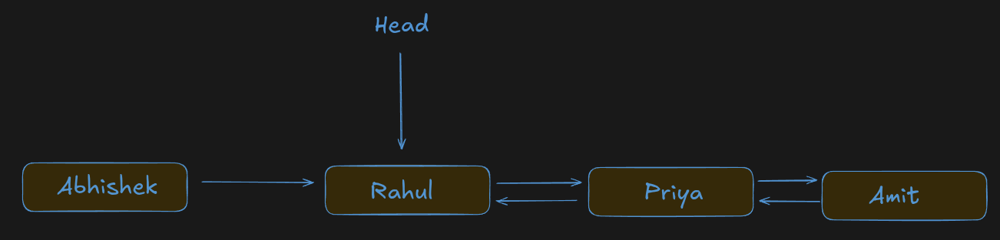
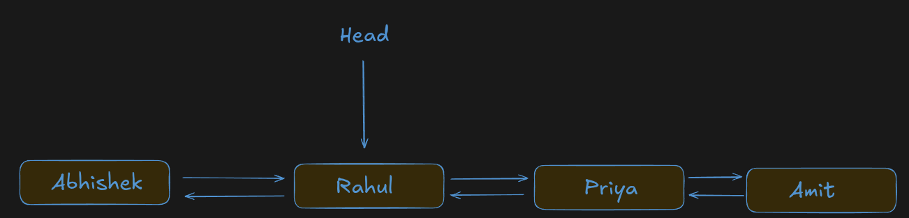
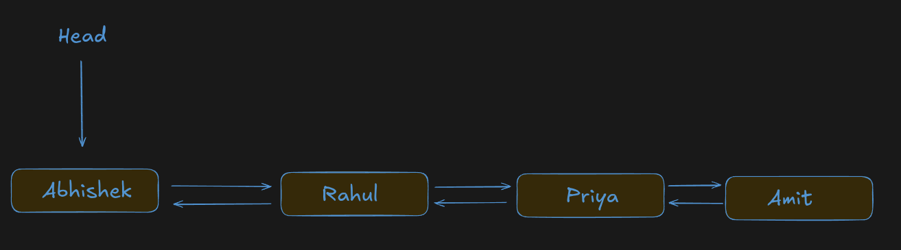

# Adding Nodes in a Doubly Linked List (DLL)

In this chapter, we'll learn how to insert (add) new nodes into a Doubly Linked List.

A Doubly Linked List supports three types of insertion:

1. Insert at the Beginning (`addAtFirst`)
2. Insert at the End (`addAtLast`)
3. Insert at a Specific Index (`addAtIndex`)

Before learning each operation, remember one important rule:

> **Whenever we insert a node into a Doubly Linked List, we must update both the `next` pointer and the `prev` pointer. If either pointer is not updated correctly, the list becomes broken.**

---

# 1. Adding a Node at the Beginning (`addAtFirst()`)

## Problem Statement

Insert a new node at the beginning of the Doubly Linked List.

The newly inserted node becomes the new **head** of the list.

---

## Real-World Example

Think of a queue of students.

Current queue:


A new student **Abhishek** arrives and should stand at the front.

Final queue:





Abhishek becomes the first student.

---

## Approach

Before writing code, think about what needs to change.

The current head is Rahul.

If Abhishek becomes the new head:

* Abhishek should point to Rahul.
* Rahul should point back to Abhishek.
* Head should now point to Abhishek.

Nothing else in the list changes.

Only the first two nodes are affected.

---

## Algorithm

1. Create a new node.
2. If the list is not empty:

   * Connect the new node to the current head.
   * Update the current head's `prev` pointer.
3. Move the head to the new node.
4. Increase the list length.

---

## Dry Run

### Initial List





---

### Step 1

Create a new node.




```text
Abhishek
```

---

### Step 2

Connect the new node to the current head.



---

### Step 3

Update Rahul's previous pointer.




---

### Step 4

Move the head.




Insertion completed.

---

## JavaScript Implementation

```javascript
addAtFirst(value) {
    const newNode = new Node(value);

    if (this.head !== null) {
        newNode.next = this.head;
        this.head.prev = newNode;
    }

    this.head = newNode;
    this.len++;
}
```

---

## Why Does This Work?

The new node is connected to the old head.

Then the old head is connected back to the new node.

Finally, the head pointer is updated.

Since every connection is updated in both directions, the list remains valid.

---

## Edge Cases

### Empty List

Before

```text
Head

↓

NULL
```

After

```text
Head

↓

Abhishek
```

Both `prev` and `next` are `NULL`.

---

### One Node

Before

```text
Rahul
```

After

```text
Abhishek ⇄ Rahul
```

---

## Complexity Analysis

### Time Complexity

```
O(1)
```

Reason:

No traversal is required.

---

### Space Complexity

```
O(1)
```

Only one new node is created.

---

## Common Mistakes

❌ Forgetting

```javascript
this.head.prev = newNode;
```

Result:

Backward traversal will fail.

---

❌ Forgetting

```javascript
this.head = newNode;
```

Result:

The new node is never added to the list.

---

## Interview Questions

### Why is insertion at the beginning O(1)?

Because we don't traverse the list.

Only pointer updates are required.

---

### Which pointers change?

* `newNode.next`
* `oldHead.prev`
* `head`

---

# 2. Adding a Node at the End (`addAtLast()`)

## Problem Statement

Insert a node at the end of the Doubly Linked List.

---

## Real-World Example

Imagine a music playlist.

```
Song A ⇄ Song B ⇄ Song C
```

A new song is added.

```
Song A ⇄ Song B ⇄ Song C ⇄ Song D
```

The new song always goes to the end.

---

## Approach

Unlike insertion at the beginning, we don't know where the last node is.

We must:

* Start from the head.
* Traverse until `current.next == null`.
* Attach the new node after the last node.
* Update both pointers.

---

## Algorithm

1. Create a new node.
2. If the list is empty, make it the head.
3. Otherwise, traverse to the last node.
4. Connect the last node with the new node.
5. Update the new node's `prev`.
6. Increase the length.

---

## Dry Run

Before

```text
Rahul ⇄ Priya ⇄ Amit
```

Create

```text
Neha
```

Move to the last node.

```text
current

↓

Amit
```

Connect

```text
Amit ⇄ Neha
```

Final

```text
Rahul ⇄ Priya ⇄ Amit ⇄ Neha
```

---

## JavaScript Implementation

```javascript
addAtLast(value) {
    const newNode = new Node(value);

    if (this.head === null) {
        this.head = newNode;
        this.len++;
        return;
    }

    let current = this.head;

    while (current.next !== null) {
        current = current.next;
    }

    current.next = newNode;
    newNode.prev = current;

    this.len++;
}
```

---

## Complexity Analysis

### Time Complexity

```
O(n)
```

Reason:

We traverse the entire list to reach the last node.

---

### Space Complexity

```
O(1)
```

---

## Optimization

If the list maintains a **tail pointer**, insertion at the end becomes:

```
O(1)
```

---

## Common Mistakes

* Forgetting to handle an empty list.
* Forgetting `newNode.prev = current`.
* Traversing until `current == null` instead of `current.next == null`.

---

## Interview Question

**Why is `addAtLast()` slower than `addAtFirst()`?**

Because finding the last node requires traversal.

---

# 3. Adding a Node at a Specific Index (`addAtIndex()`)

## Problem Statement

Insert a node at any valid index.

Example:

Before

```text
0      1      2      3

Rahul ⇄ Priya ⇄ Amit ⇄ Neha
```

Insert **Sneha** at index **2**.

After

```text
Rahul ⇄ Priya ⇄ Sneha ⇄ Amit ⇄ Neha
```

---

## Approach

There are only three possible situations.

### Case 1

Insert at index **0**

Use `addAtFirst()`.

---

### Case 2

Insert at index **length**

Use `addAtLast()`.

---

### Case 3

Insert somewhere in the middle.

Move to the node just before the target index.

Reconnect four pointers carefully.

---

## Algorithm

1. Validate the index.
2. Handle index `0`.
3. Handle index `length`.
4. Traverse to `index - 1`.
5. Create the new node.
6. Update:

   * `newNode.next`
   * `newNode.prev`
   * `current.next.prev`
   * `current.next`
7. Increase the length.

---

## Dry Run

Before

```text
Rahul ⇄ Priya ⇄ Amit ⇄ Neha
```

Move to

```text
Priya
```

Insert

```text
Sneha
```

Reconnect

```text
Rahul ⇄ Priya ⇄ Sneha ⇄ Amit ⇄ Neha
```

---

## JavaScript Implementation

```javascript
addAtIndex(index, value) {

    if (index < 0 || index > this.len)
        return;

    if (index === 0)
        return this.addAtFirst(value);

    if (index === this.len)
        return this.addAtLast(value);

    const newNode = new Node(value);

    let current = this.head;

    for (let i = 0; i < index - 1; i++) {
        current = current.next;
    }

    newNode.next = current.next;
    newNode.prev = current;

    current.next.prev = newNode;
    current.next = newNode;

    this.len++;
}
```

---

## Why This Order Matters

Never overwrite `current.next` first.

Wrong:

```javascript
current.next = newNode;
```

If you do this first, you lose the reference to the remaining list.

Always save the existing connection before replacing it.

---

## Complexity Analysis

### Time Complexity

```
O(n)
```

Reason:

Finding the insertion position requires traversal.

---

### Space Complexity

```
O(1)
```

---

## Common Mistakes

* Invalid index check.
* Forgetting `current.next.prev`.
* Updating pointers in the wrong order.
* Forgetting `this.len++`.

---

# Comparison Table

| Operation      | Traversal Required | Time | Space |
| -------------- | ------------------ | ---- | ----: |
| `addAtFirst()` | ❌ No               | O(1) |  O(1) |
| `addAtLast()`  | ✅ Yes              | O(n) |  O(1) |
| `addAtIndex()` | ✅ Yes              | O(n) |  O(1) |

