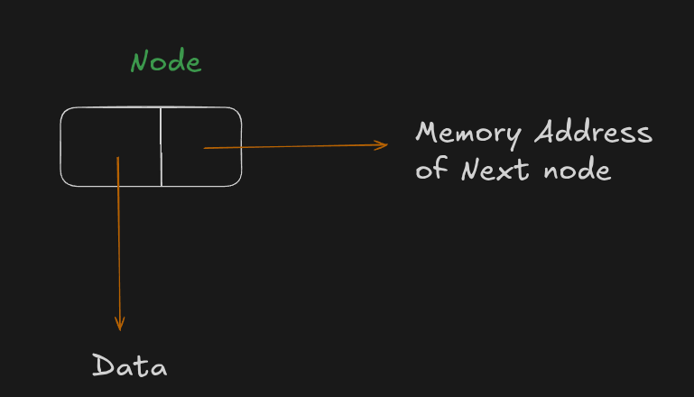
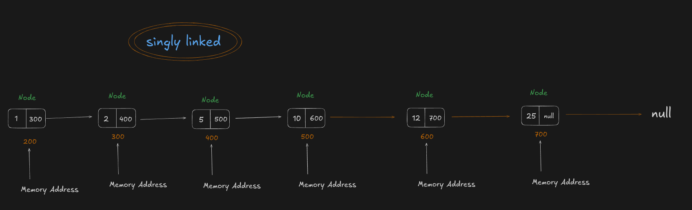
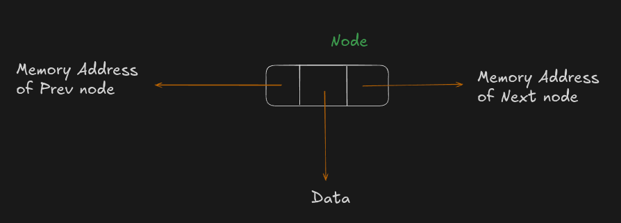
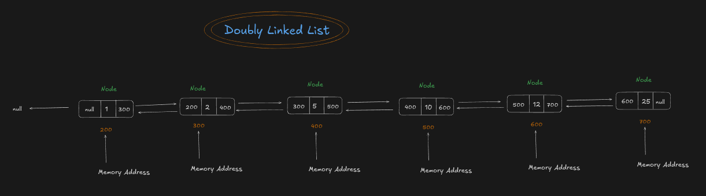

# 📘 Doubly Linked List (DLL) — Complete Introduction (Beginner Notes)

---

# 🚀 We Already Learned About Singly Linked List

In the previous lesson, we learned about the **Singly Linked List**.

A Singly Linked List is made up of **nodes**, where every node is connected to the next node using a memory address.

Each node stores only **two things**.

1. **Data (Value)**
2. **Memory Address of the Next Node**

```text
+---------+---------+
|  Value  |  Next   |
+---------+---------+
```



The **Next** field stores the memory address of the next node.

Because every node only knows about the next node, we can move **only in one direction**, which is **forward**.

---

# 🤔 The Limitation of a Singly Linked List

Let's understand this with an example.

Suppose we have the following linked list.



Now let's do a dry run.

We start from the **Head**.

```text
Head
 ↓
1
 ↓
2
 ↓
5
 ↓
10
 ↓
12
 ↓
25
```

Finally, we have reached the last node (**25**).

Now imagine someone asks us,

> "Can you go back to node **12**?"

Can we do something like this?

```text
25
↑
12
↑
10
↑
5
↑
2
↑
1
```

### ❌ No.

We cannot move backward.

But why?

Let's understand.

---

# ❓ Why Can't We Move Backward?

Look at the last node.

```text
+---------+---------+
|   25    |  NULL   |
+---------+---------+
```

This node stores only two things.

```text
Value = 25

Next = NULL
```

Notice something important.

The node stores

* The value **25**
* The address of the next node (**NULL**)

But does it store the address of node **12**?

**No.**

There is no information about the previous node.

---

Let's look at another example.

Node **10** looks like this.

```text
+---------+---------+
|   10    |  500    |
+---------+---------+
```

Here,

```text
Value = 10

Next = Address of node 12
```

Node **10** knows where **12** is stored.

But does node **10** know where **5** is stored?

❌ No.

Similarly,

Node **12** knows where **25** is stored.

But node **12** does not know where **10** is stored.

Every node only knows about the **next node**.

It never knows about the previous one.

---

# What Happens After Moving Forward?

Suppose we keep moving.

```text
Head

 ↓

1 → 2 → 5 → 10 → 12 → 25
```

Once we finally reach **25**, all previous nodes are behind us.

Node **25** has no idea

* where **12** is
* where **10** is
* where **5** is
* where **2** is
* where **1** is

That information is simply **not stored** inside node 25.

This is why we lose the path behind us.

---

# 🤔 Then How Can We Reach Node 12 Again?

Suppose we are standing at **25**.

Now we want to go back to **12**.

Can node **25** directly take us there?

❌ No.

Since node **25** doesn't know where **12** is stored, we have only one option.

We have to start from the **Head** again.

```text
Head

 ↓

1 → 2 → 5 → 10 → 12
```

We must traverse the entire list again until we reach **12**.

This is inefficient.

---

# 🚨 The Biggest Limitation of a Singly Linked List

A Singly Linked List allows us to move

✅ Forward

But it does **not** allow us to move

❌ Backward

This is the biggest limitation of a Singly Linked List.

---

# 💡 This Is Why Doubly Linked List Was Introduced

To solve this limitation, a new data structure was introduced.

It is called the **Doubly Linked List**.

Instead of storing only the address of the next node,

every node stores

* the address of the previous node
* the data
* the address of the next node

Because of this,

every node knows

* who comes before it
* who comes after it

Now we can move

➡️ Forward

and

⬅️ Backward

---

# 📖 What is a Doubly Linked List?

A **Doubly Linked List** is a linear data structure in which every node stores **three fields**.

1. **Memory Address of the Previous Node (Prev)**
2. **Data (Value)**
3. **Memory Address of the Next Node (Next)**



📷 **Insert: Doubly Linked List Node Image**

Unlike a Singly Linked List,

every node is connected in **both directions**.

---

# 🔄 Example

```text
NULL ←→ 1 ←→ 2 ←→ 5 ←→ 10 ←→ 12 ←→ 25 ←→ NULL
```



Now suppose we are standing at **10**.

We can move forward.

```text
10 → 12 → 25
```

We can also move backward.

```text
10 → 5 → 2 → 1
```

No need to restart from the Head.

This is possible because node **10** stores

```text
Prev = Address of 5

Data = 10

Next = Address of 12
```

It knows both neighboring nodes.

---

# ✅ What Problems Does a Doubly Linked List Solve?

Compared to a Singly Linked List,

a Doubly Linked List provides many advantages.

✅ Forward Traversal

We can move from the first node to the last node.

---

✅ Backward Traversal

We can also move from the last node back to the first node.

---

✅ Easier Deletion

Since every node knows its previous node,

deleting a node becomes much easier.

---

✅ Easier Insertion

We can insert a node before or after another node more easily.

---

✅ Better Navigation

Moving between nodes becomes much faster because every node knows both directions.

---

# 🌍 Real-World Applications

Doubly Linked Lists are used in many real-world applications.

🌐 Browser Back & Forward buttons

🎵 Previous & Next songs in Music Players

📝 Undo & Redo in Text Editors

🖼️ Image Gallery Navigation

📂 File Explorer History

🔄 LRU (Least Recently Used) Cache

🚗 Navigation History

---

# 📊 Singly Linked List vs Doubly Linked List

| Singly Linked List                   | Doubly Linked List                |
| ------------------------------------ | --------------------------------- |
| Stores Data + Next                   | Stores Prev + Data + Next         |
| Can move only Forward                | Can move Forward & Backward       |
| Uses Less Memory                     | Uses More Memory                  |
| Simpler Structure                    | Slightly More Complex             |
| No Previous Pointer                  | Previous Pointer Available        |
| Deletion is harder                   | Deletion is easier                |
| Insertion before a node is difficult | Insertion before a node is easier |

---

# 🎯 Key Takeaways

* A **Singly Linked List** node stores only **Data** and the **Next** pointer.
* Since there is no **Previous** pointer, we cannot move backward.
* If we need to revisit a previous node, we must start again from the **Head**.
* A **Doubly Linked List** solves this problem by adding an extra **Previous** pointer.
* Every node stores **Prev**, **Data**, and **Next**.
* Because each node knows both its previous and next nodes, we can traverse the list in **both directions**.
* The trade-off is that a Doubly Linked List uses **more memory**, but it provides more flexibility and makes insertion, deletion, and navigation much more efficient.

---

## ⭐ Remember This Interview Line

> **A Doubly Linked List was introduced to overcome the biggest limitation of a Singly Linked List: the inability to traverse backward. By storing both previous and next node addresses, it allows bidirectional traversal and makes insertion and deletion operations more efficient.**
