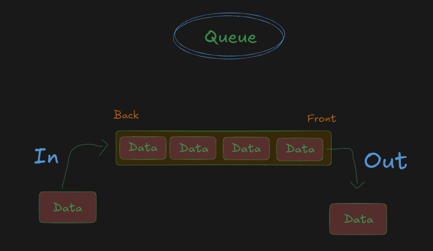
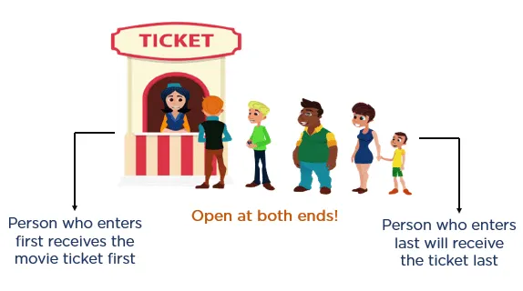

## 📌 What is a Queue?

A **Queue** is a **Linear Data Structure** that follows the **FIFO (First In, First Out)** principle.

**FIFO (First In, First Out)** means:


> The element that is inserted **first** will be **removed first**.

You can think of a queue exactly like a line of people waiting for a service.

* New elements are always added at the **Rear (Back)** of the queue.
* Elements are always removed from the **Front** of the queue.

Because of this behaviour, a Queue is called a **FIFO Data Structure**.

---




## Why is it called FIFO?

A Queue is called **FIFO (First In, First Out)** because the **first element inserted into the queue is the first element removed from the queue**.

In a Queue:

* New elements are always inserted at the **Rear (Back)**.
* Elements are always removed from the **Front**.
* Therefore, the element that enters the queue first gets the opportunity to leave first.

In simple words:

> **The first data that goes into the queue is the first data that comes out of the queue.**

This order of processing is known as **FIFO (First In, First Out)**.

### Example

```text
Insertion Order (Enqueue)

10 → 20 → 30 → 40
```

The removal order will be:

```text
Deletion Order (Dequeue)

10 → 20 → 30 → 40
```

Notice that the **insertion order** and the **deletion order** are exactly the same.

* **10** was inserted first → removed first.
* **20** was inserted second → removed second.
* **30** was inserted third → removed third.
* **40** was inserted last → removed last.

Hence, a Queue follows the **FIFO (First In, First Out)** principle.


<!-- sdfzxfdcxSZdf -->
# Queue Visualization

```
              Rear (Insertion)
                    ↓

+-------+-------+-------+-------+
| Rahul | Aman  | Priya | Rohit |
+-------+-------+-------+-------+
    ↑
 Front (Deletion)
```

* **Enqueue → Rear**
* **Dequeue → Front**

---

# Queue Operations

A Queue mainly supports the following operations.

| Operation    | Description                      |
| ------------ | -------------------------------- |
| Enqueue      | Insert an element at the Rear    |
| Dequeue      | Remove an element from the Front |
| Front (Peek) | View the first element           |
| Rear         | View the last element            |
| isEmpty      | Check whether the queue is empty |
| Size         | Return the number of elements    |

---

# How Queue Works


# Real-Life Examples

Queue is one of the most common data structures used in everyday life.

## 🎟️ 1. Movie Ticket Counter


Imagine people standing in a line to buy movie tickets.



```

Rahul
Aman
Priya
Rohit


```

* Rahul joined first.
* Rahul gets the ticket first.
* Aman gets the ticket second.

Exactly FIFO.

---

## 🏧 2. ATM Queue

People stand in a line.


```
Front

Person A
Person B
Person C

Rear
```

The first person who came to the ATM is served first.

---


## 🍔 3. Food Ordering System


Customers order food.

```
Customer A
Customer B
Customer C
```

Restaurant prepares orders in the same sequence.

---


# Why Do We Need Queue?

A Queue is useful whenever we want to process data in the exact order in which it arrives.

Examples:

* Print jobs
* Banking systems
* Ticket booking systems
* Task scheduling
* Message queues
* Web servers
* BFS (Breadth-First Search)
* Request handling
* Call centres

---

# Important Terms


## Front

The position from where elements are removed.

```
Front

10 20 30
↑
```

---

## Rear

The position where new elements are inserted.

```
10 20 30
       ↑
      Rear
```

---

# Queue Characteristics

* Linear Data Structure
* Follows FIFO (First In, First Out)
* Insertion happens only at the Rear
* Deletion happens only at the Front
* Easy to implement
* Used in scheduling and resource management
* Can be implemented using Arrays or Linked Lists

---


