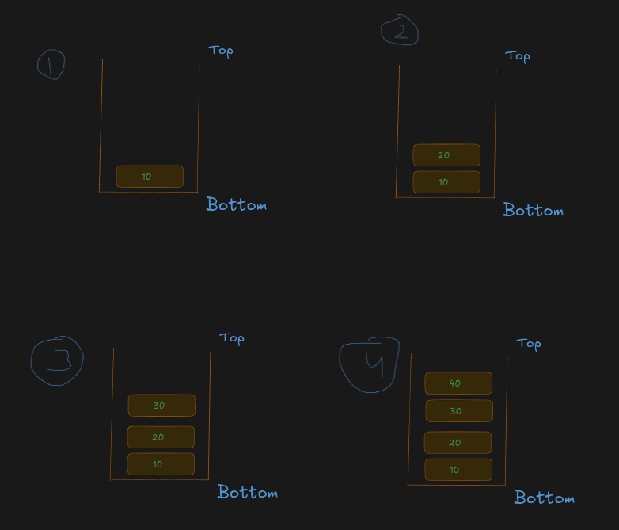

## 📌 What is a Stack?

A **Stack** is a **Linear Data Structure** that follows the **LIFO (Last In, First Out)** principle.

**LIFO (Last In, First Out)** means:

> **The element that is inserted last is the first element to be removed.**

Unlike a Queue, where insertion and deletion happen at different ends, in a **Stack**, both insertion and deletion take place from the **same end**, called the **Top** of the Stack.

* New elements are always added to the **Top**.
* Elements are always removed from the **Top**.

Because the last inserted element is the first one to be removed, a Stack is known as a **LIFO Data Structure**.


---

# Definition

> **A Stack is a linear data structure in which insertion (Push) and deletion (Pop) are performed only at one end called the Top, following the LIFO (Last In, First Out) principle.**

---

# Why is it called LIFO?

A Stack is called **LIFO (Last In, First Out)** because the **last element inserted into the stack is always the first element removed**.

In a Stack:

* New elements are always inserted at the **Top**.
* Elements are also removed from the **Top**.
* Therefore, the most recently added element leaves first.

In simple words:

> **The last data that goes into the stack is the first data that comes out of the stack.**

---

## Example

Suppose we insert the following elements into a stack.

```text
Push Order

10 → 20 → 30 → 40
```



The removal order will be:

```text
Pop Order

40 → 30 → 20 → 10
```


Notice that:

* **40** was inserted last → removed first.
* **30** was inserted third → removed second.
* **20** was inserted second → removed third.
* **10** was inserted first → removed last.

This behaviour is called **LIFO (Last In, First Out).**

---

# Stack Visualization

```text
             Top
              ↓
+--------+
|   40   | ← Last inserted
+--------+
|   30   |
+--------+
|   20   |
+--------+
|   10   | ← First inserted
+--------+
```

Perform **Pop()**

```text
40 is removed
```

Remaining Stack

```text
             Top
              ↓
+--------+
|   30   |
+--------+
|   20   |
+--------+
|   10   |
+--------+
```

---

# Stack Operations

A Stack mainly supports the following operations.

| Operation  | Description                              |
| ---------- | ---------------------------------------- |
| Push       | Insert an element at the Top             |
| Pop        | Remove the Top element                   |
| Peek (Top) | View the Top element without removing it |
| isEmpty    | Check whether the stack is empty         |
| Size       | Return the number of elements            |

---

# How Stack Works

Suppose we perform these operations.

---

### Step 1

Push(10)

```text
Top
 ↓

+----+
| 10 |
+----+
```

---

### Step 2

Push(20)

```text
Top
 ↓

+----+
| 20 |
+----+
| 10 |
+----+
```

---

### Step 3

Push(30)

```text
Top
 ↓

+----+
| 30 |
+----+
| 20 |
+----+
| 10 |
+----+
```

---

### Step 4

Push(40)

```text
Top
 ↓

+----+
| 40 |
+----+
| 30 |
+----+
| 20 |
+----+
| 10 |
+----+
```

---

### Step 5

Pop()

```text
40 is removed
```

Remaining Stack

```text
Top
 ↓

+----+
| 30 |
+----+
| 20 |
+----+
| 10 |
+----+
```

Notice that the **last inserted element (40)** is also the **first removed**.

---

# Real-Life Examples

Stack is used in many everyday situations.

---

## 📚 1. Stack of Books


One of the best real-life examples of a **Stack** is a **stack of books**.

Imagine you place books one on top of another. Whenever you want to add a new book, you always place it **on the top** of the existing stack. Similarly, when you want to take a book, you always remove the **topmost book** first. You cannot remove a book from the middle or the bottom without first removing all the books above it.

### Initial Stack

```text
          Top
           ↓
+---------+
| Book 4  | ← Last Book Placed
+---------+
| Book 3  |
+---------+
| Book 2  |
+---------+
| Book 1  | ← First Book Placed
+---------+
```

Suppose the books are placed in this order:

```text
Book 1 → Book 2 → Book 3 → Book 4
```

Now, if you start removing the books, they will come out in this order:

```text
Book 4 → Book 3 → Book 2 → Book 1
```

### Observation

* **Book 1** was placed first, so it is removed last.
* **Book 2** was placed second, so it is removed after Book 3.
* **Book 3** was placed third, so it is removed second.
* **Book 4** was placed last, so it is removed first.

Since the **last book placed on the stack is the first book removed**, this follows the **LIFO (Last In, First Out)** principle.


## 🍽️ 2. Stack of Plates


In restaurants, clean plates are stacked one above another.

```text
Top
 ↓

Plate 4
Plate 3
Plate 2
Plate 1
```

The plate placed last is picked first.

---

## 🌐 3. Browser Back Button

When you visit websites:

```text
Google
   ↓
YouTube
   ↓
GitHub
   ↓
LeetCode
```

Clicking **Back** takes you to:

```text
LeetCode
GitHub
YouTube
Google
```

The last visited page is returned first.

---

## ↩️ 4. Undo Feature

While editing a document:

```text
Type A
Type B
Type C
```

Undo works as:

```text
Undo C
Undo B
Undo A
```

The last action is undone first.

---

## 📞 5. Function Calls

Programming languages use a **Call Stack**.

```text
main()

↓

login()

↓

validate()

↓

checkPassword()
```

When functions finish:

```text
checkPassword()
validate()
login()
main()
```

The last called function returns first.

---

## 🎮 6. Backtracking

Games like Sudoku and Maze solving use a stack.

```text
Move 1
Move 2
Move 3
```

If a wrong move is found:

```text
Back to Move 3
Back to Move 2
Back to Move 1
```

---

## 🧭 7. Navigation History

Many applications remember previous screens using a stack.

```text
Home
↓

Products
↓

Product Details
↓

Payment
```

Pressing Back:

```text
Payment
↓

Product Details
↓

Products
↓

Home
```

---

# Why Do We Need a Stack?

A Stack is useful whenever we need to process the **most recent item first**.

Examples:

* Function Calls
* Browser History
* Undo/Redo
* Parentheses Matching
* Expression Evaluation
* DFS (Depth First Search)
* Backtracking
* Memory Management

---

# Important Terms

## Top

The **Top** is the position where elements are inserted and removed.

```text
Top
 ↓

40
30
20
10
```

---

## Push

Adding a new element to the Top.

```text
Before

30
20
10

Push(40)

40
30
20
10
```

---

## Pop

Removing the Top element.

```text
Before

40
30
20
10

Pop()

30
20
10
```

---

## Peek (Top)

Returns the Top element without removing it.

```text
Stack

40
30
20
10

Peek()

40
```

---

# Stack Characteristics

* Linear Data Structure
* Follows LIFO
* Push and Pop happen only at the Top
* Easy to implement
* Can be implemented using Arrays or Linked Lists
* Stores elements in sequential order

---

# Stack vs Queue

| Stack                    | Queue                       |
| ------------------------ | --------------------------- |
| LIFO                     | FIFO                        |
| Push at Top              | Enqueue at Rear             |
| Pop from Top             | Dequeue from Front          |
| One pointer (Top)        | Two pointers (Front & Rear) |
| Example: Stack of Plates | Example: Ticket Counter     |

---

# Time Complexity

| Operation | Time     |
| --------- | -------- |
| Push      | **O(1)** |
| Pop       | **O(1)** |
| Peek      | **O(1)** |
| isEmpty   | **O(1)** |
| Size      | **O(1)** |

---

# Applications of Stack

* Function Call Stack
* Browser History
* Undo/Redo Operations
* Parentheses Matching
* Expression Evaluation
* Infix to Postfix Conversion
* Postfix Evaluation
* Depth First Search (DFS)
* Backtracking Algorithms
* Compiler Design
* Memory Management
* Recursive Function Calls

---

# Advantages

* Simple and easy to implement.
* Fast insertion and deletion (**O(1)**).
* Efficient memory usage.
* Ideal for recursive algorithms.
* Widely used in programming languages and operating systems.

---

# Disadvantages

* Only the Top element can be accessed directly.
* Middle elements cannot be accessed efficiently.
* Fixed-size array implementation may overflow.
* Not suitable when FIFO behaviour is required.

---

# Interview Definition ⭐

> **A Stack is a linear data structure that follows the LIFO (Last In, First Out) principle, where both insertion (Push) and deletion (Pop) are performed only at one end called the Top. The last element inserted into the stack is the first element removed. Stacks are widely used in function calls, browser history, undo/redo operations, expression evaluation, and backtracking algorithms.**

---
